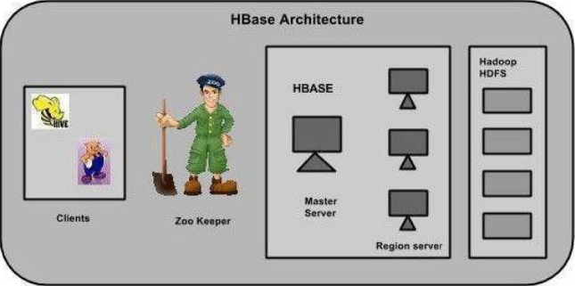
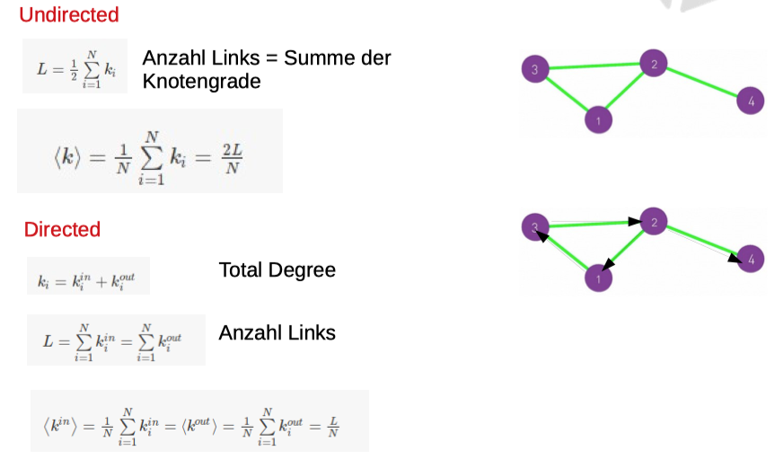
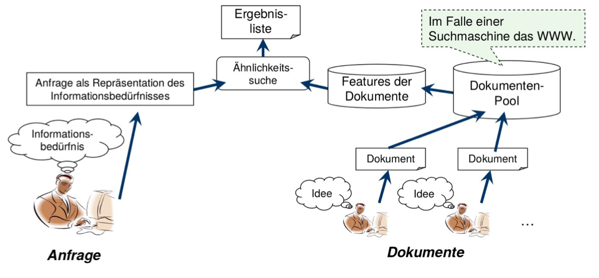
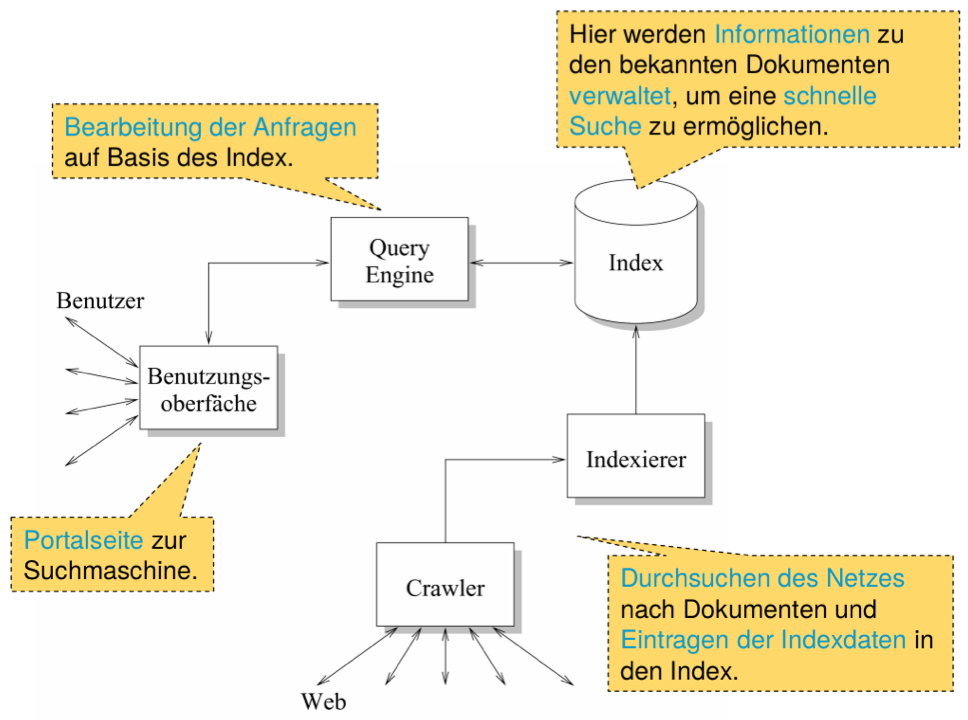
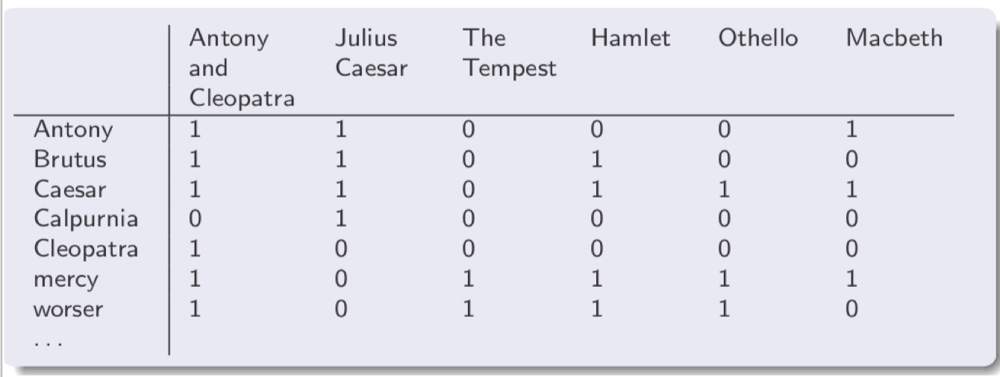
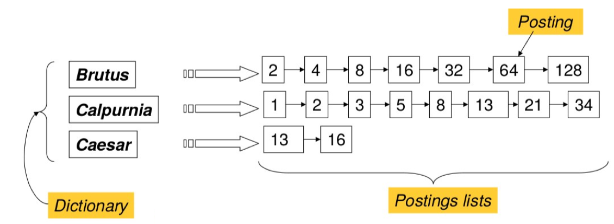

# EDS, Einführung in Data Science, INF-P-IN010, BE1, HS20/21

- [EDS, Einführung in Data Science, INF-P-IN010, BE1, HS20/21](#eds--einf-hrung-in-data-science--inf-p-in010--be1--hs20-21)
  * [1 Big Data und NoSQL für die Datenanalyse](#1-big-data-und-nosql-f-r-die-datenanalyse)
      - [Lernziele](#lernziele)
      - [Vorbereitung](#vorbereitung)
        * [Installation der Arbeitsumgebung](#installation-der-arbeitsumgebung)
          + [Probleme:](#probleme-)
        * [MiningTheSocialWeb](#miningthesocialweb)
        * [Video: Twitter System Design](#video--twitter-system-design)
          + [Verständnisfragen:](#verst-ndnisfragen-)
          + [Redis](#redis)
          + [Storm / Heron](#storm---heron)
          + [Kafka](#kafka)
          + [Zookeeper](#zookeeper)
          + [Search Service (Lucene)](#search-service--lucene-)
      - [Präsenz](#pr-senz)
        * [Data Science](#data-science)
          + [Relationale Datenbanken](#relationale-datenbanken)
          + [Nicht Relationale Datenbanken](#nicht-relationale-datenbanken)
          + [NoSQL Datenbanken](#nosql-datenbanken)
          + [Programme](#programme)
          + [Probleme](#probleme)
          + [Zusammenfassung](#zusammenfassung)
        * [Data Science und Ethik](#data-science-und-ethik)
          + [Analyse von Social Media Daten](#analyse-von-social-media-daten)
          + [Workshop](#workshop)
      - [Nachbearbeitung](#nachbearbeitung)
          + [Vorbereitung: Darstellung einer Vorgehensweise (2 h)](#vorbereitung--darstellung-einer-vorgehensweise--2-h-)
          + [Semesterarbeit 1 (Leistungsnachweis ca. 12 h)](#semesterarbeit-1--leistungsnachweis-ca-12-h-)
  * [2 Netzwerkanalyse](#2-netzwerkanalyse)
      - [Lernziele](#lernziele-1)
      - [Vorbereitung](#vorbereitung-1)
          + [Lektüre und Übungen: (10 h)](#lekt-re-und--bungen---10-h-)
        * [Computing Graph Centrality Measures](#computing-graph-centrality-measures)
          + [Probleme](#probleme-1)
      - [Präsenz](#pr-senz-1)
        * [Grundbegriffe](#grundbegriffe)
        * [Einfache graphen](#einfache-graphen)
        * [Grad eines Knotens](#grad-eines-knotens)
        * [Clique](#clique)
        * [Bipartite Netzwerke](#bipartite-netzwerke)
        * [Density - Dichte eines Graphen](#density---dichte-eines-graphen)
        * [Adjazenz-Matrizen](#adjazenz-matrizen)
        * [Pfade und Pfadlängen](#pfade-und-pfadl-ngen)
        * [Durchmesser](#durchmesser)
        * [Cluster-Coefficient](#cluster-coefficient)
        * [Gradverteilung](#gradverteilung)
        * [Zentralitätsmassen](#zentralit-tsmassen)
          + [Dregee Centrality: Wer hat viele Freunde?](#dregee-centrality--wer-hat-viele-freunde-)
          + [Closeness Centrslity: Wo sind die Hubs?](#closeness-centrslity--wo-sind-die-hubs-)
          + [Betweeness Centrslity: Wo sind die Brücken?](#betweeness-centrslity--wo-sind-die-br-cken-)
          + [Eigenvalue Centrality: Wer hat am meisten Einfluss?](#eigenvalue-centrality--wer-hat-am-meisten-einfluss-)
          + [Page Rank: Wer hat die meisten "In-Links"](#page-rank--wer-hat-die-meisten--in-links-)
        * [Knotenausfall](#knotenausfall)
        * [Impfen in Skalenfreie Netzwerke](#impfen-in-skalenfreie-netzwerke)
      - [Nachbearbeitung](#nachbearbeitung-1)
  * [3 Überwachtes Lernen](#3--berwachtes-lernen)
      - [Lernziele](#lernziele-2)
      - [Vorbereitung](#vorbereitung-2)
      - [Präsenz](#pr-senz-2)
      - [Nachbearbeitung](#nachbearbeitung-2)
  * [4 Unüberwachtes Lernen](#4-un-berwachtes-lernen)
      - [Lernziele](#lernziele-3)
      - [Vorbereitung](#vorbereitung-3)
      - [Präsenz](#pr-senz-3)
        * [Überwachtes Lernen](#-berwachtes-lernen)
        * [Unüberwachtes Lernen](#un-berwachtes-lernen)
        * [Beispiele:](#beispiele-)
        * [Metriken:](#metriken-)
        * [Clustering Algorithmen](#clustering-algorithmen)
      - [Nachbearbeitung](#nachbearbeitung-3)
  * [5 Information Retrieval und Text Analytics](#5-information-retrieval-und-text-analytics)
      - [Lernziele](#lernziele-4)
      - [Vorbereitung](#vorbereitung-4)
          + [Ziel](#ziel)
          + [Auftrag](#auftrag)
          + [Verständnisfragen](#verst-ndnisfragen)
      - [Präsenz](#pr-senz-4)
      - [Nachbearbeitung](#nachbearbeitung-4)
  * [Kursmaterial](#kursmaterial)


---
## 1 Big Data und NoSQL für die Datenanalyse

#### Lernziele

- Ich kann die Begriffe Data Science und Big Data definieren und positionieren.
- Ich kann qualifiziert über Ethik und Data Science diskutieren
- Ich kann die Grundzüge und Herausforderungen einer Big Data Systemarchitektur anhand eines konkreten Beispiels erläutern.
- Ich kann das CAP Theorem erläutern und kenne verschiedene Transaktionskonzepte
- Ich kann den Unterschied zwischen realtime und batch Datenanalyse erläutern.
- Ich habe erste Erfahrungen mit der Analyse von Social Media Daten gesammelt.

---
#### Vorbereitung

##### Installation der Arbeitsumgebung

- [Mining the Social Web](https://github.com/mikhailklassen/Mining-the-Social-Web-3rd-Edition)
    
- Dev-Account Twitter
    - FFHSChriGro: @FChriGro
        ...@twitterffhs
    - AppName: FFHSChristophGrossmann
    - API key:WyHQPwl1pfCNBoDTR4KzCLVBn
    - API key secret:WBWp15uniPm96xgYqtEgiKuPH0xVPhJl7CqDfhGSUeT8AzeBiS
    - Bearer token:AAAAAAAAAAAAAAAAAAAAAJv7GgEAAAAAWKL%2BGgyIiFrsPeKzq5w0qLaT4EY%3DtsESKBmrMWRe6qOt0gOyUXT48mSn9k6PYWfXWqj6rNhc6dycG1
    


###### Probleme:

**Installation wird abgebrochen:**

  Attempting uninstall: terminado
    Found existing installation: terminado 0.8.3
ERROR: Cannot uninstall 'terminado'. It is a distutils installed project and thus we cannot accurately determine which files belong to it which would lead to only a partial uninstall.
Removing intermediate container b0670881efd7
The command '/bin/sh -c ${KERNEL_PYTHON_PREFIX}/bin/pip install --no-cache-dir -r "binder/requirements.txt"' returned a non-zero code: 1

**Lösung:**
Hatte dasselbe Problem. Du musst das Repository klonen und unter /Mining-the-Social-Web-3rd-Edition/binder/requirements.txt die Version von terminado von 0.8.2 auf 0.8.3 erhöhen. Nun kannst du mit dem Befehl repo2docker das Verzeichnis aufrufen, in welches das Projekt geklont wurde. Dann sollte es klappen.

[Personal Clone of Mining the Social Web 3rd Edition](https://git.ffhs.ch/christoph.grossmann/eds-mining-the-social-web-3rd-edition)

---

##### MiningTheSocialWeb

Start Container:
docker run -p  PORTHost:PORTContainer IMAGE_ID jupyter notebook --ip 0.0.0.0
IMAGE_ID: 37c0d0531e57
r2dhttps-3a-2f-2fgit-2effhs-2ech-2fchristoph-2egrossmann-2feds-2dmining-2dthe-2dsocial-2dweb-2d3rd-2dedition-2egit9fc173c
[Jupiter Notebook](http://127.0.0.1:51622/tree/notebooks#notebooks)

Twitter Package:
pip3 install twitter
pip3 install prettytable
pip3 install matplotlib
pip install nltk


---
##### Video: Twitter System Design

- [YouTube: Twitter System Design](https://youtu.be/wYk0xPP_P_8)

###### Verständnisfragen:
- Welche Datenmengen verarbeitet Twitter? (Recherchieren Sie aktuelle Zahlen)
    - Anzahl Tweets pro Minute (resp. pro Sekunde)
        - Es wurden 1,3 Milliarden Accounts erstellt.
        - 300M+ Users / Es gibt 330 Millionen monatlich aktive Nutzer und 145 Millionen täglich aktive Nutzer.
        - Write: 600 Tweets/Sec / Jeden Tag werden 500 Millionen Tweets versendet. Das sind 6.000 Tweets pro Sekunde.
        - Reads: 600k Tweets/Sec / avg 1 Tweet = 1000 reads
    - Vorhandenes Datenvolumen
    2011 8TB ?!?
    - Anzahl Nodes im Big Data Cluster
    ca. 10k
- In der vorgestellten Systemarchitektur werden die folgenden Systemkomponenten erwähnt:

    

    - Redis
    - Storm / Heron
    - Kafka
    - Zookeeper
    - Search Service (Lucene)
    
###### Redis

[Redis](https://redis.io)
- Recherchieren Sie zu diesen Systemen die folgenden Angaben:
    - Wer stellt das System her?
        - [RedisLabs](https://redislabs.com/company/) 
    - Wie beschreibt der Hersteller das System?
        - [RedisLoabs - Community - Why Redis](https://redislabs.com/why-redis/)
    - Wer (ausser Twitter) setzt das System ein?
        - [stacksahre.io/redis](https://stackshare.io/redis)
        - Uber
        - Airbnb
        - Pinterest
        - Instagram
        - Udemy
        - ...
    - Welche Datenmengen kann das System verarbeiten?
        - [Redis FAQ](https://redis.io/topics/faq)
        - **What is the maximum number of keys a single Redis instance can hold? and what is the max number of elements in a Hash, List, Set, Sorted Set?**
          Redis can handle up to 232 keys, and was tested in practice to handle at least 250 million keys per instance.
          Every hash, list, set, and sorted set, can hold 232 elements.
          In other words your limit is likely the available memory in your system.
        - Keyvaluestore
    
###### Storm / Heron

[Storm](https://storm.apache.org)
[Heron](https://blog.twitter.com/engineering/en_us/a/2015/flying-faster-with-twitter-heron.html)
- Recherchieren Sie zu diesen Systemen die folgenden Angaben:
    - Wer stellt das System her?
        - [Apache](https://www.apache.org)
    - Wie beschreibt der Hersteller das System?
        - Apache Storm is a free and open source distributed realtime computation system. Apache Storm makes it easy to reliably process unbounded streams of data, doing for realtime processing what Hadoop did for batch processing. Apache Storm is simple, can be used with any programming language, and is a lot of fun to use!
          Apache Storm has many use cases: realtime analytics, online machine learning, continuous computation, distributed RPC, ETL, and more. Apache Storm is fast: a benchmark clocked it at over a million tuples processed per second per node. It is scalable, fault-tolerant, guarantees your data will be processed, and is easy to set up and operate.
          Apache Storm integrates with the queueing and database technologies you already use. An Apache Storm topology consumes streams of data and processes those streams in arbitrarily complex ways, repartitioning the streams between each stage of the computation however needed. Read more in the tutorial.
          Queueing Sytem - Echtzeit verarbeitung der Daten
          Trends Daten
    - Wer (ausser Twitter) setzt das System ein?
        - Yahoo!
        - Spotify
        - yelp
        - Flipboard
    - Welche Datenmengen kann das System verarbeiten?
        - Apache Storm is fast: a benchmark clocked it at over a million tuples processed per second per node

###### Kafka

[Kafka](https://kafka.apache.org)
- Recherchieren Sie zu diesen Systemen die folgenden Angaben:
    - Wer stellt das System her?
        - [Apache](https://www.apache.org)
    - Wie beschreibt der Hersteller das System?
        - Apache Kafka® is a distributed streaming platform. What exactly does that mean?
          
          A streaming platform has three key capabilities:
          
          Publish and subscribe to streams of records, similar to a message queue or enterprise messaging system.
          Store streams of records in a fault-tolerant durable way.
          Process streams of records as they occur.
          Kafka is generally used for two broad classes of applications:
          
          Building real-time streaming data pipelines that reliably get data between systems or applications
          Building real-time streaming applications that transform or react to the streams of data
          To understand how Kafka does these things, let's dive in and explore Kafka's capabilities from the bottom up.
          
          First a few concepts:
          
          Kafka is run as a cluster on one or more servers that can span multiple datacenters.
          The Kafka cluster stores streams of records in categories called topics.
          Each record consists of a key, a value, and a timestamp.
          
          Verarbeiten der Daten.
    - Wer (ausser Twitter) setzt das System ein?
        - Pinterest
        - Zalando
        - adidas
        - The New York Times
        - ...
    - Welche Datenmengen kann das System verarbeiten?
        - [Kafka Performance](https://engineering.linkedin.com/kafka/benchmarking-apache-kafka-2-million-writes-second-three-cheap-machines)
        
###### Zookeeper

[Zookeeper](https://zookeeper.apache.org)
- Recherchieren Sie zu diesen Systemen die folgenden Angaben:
    - Wer stellt das System her?
        - [Apache](https://www.apache.org)
    - Wie beschreibt der Hersteller das System?
        - What is ZooKeeper?
          ZooKeeper is a centralized service for maintaining configuration information, naming, providing distributed synchronization, and providing group services. All of these kinds of services are used in some form or another by distributed applications. Each time they are implemented there is a lot of work that goes into fixing the bugs and race conditions that are inevitable. Because of the difficulty of implementing these kinds of services, applications initially usually skimp on them, which make them brittle in the presence of change and difficult to manage. Even when done correctly, different implementations of these services lead to management complexity when the applications are deployed.
          [Zookeeper Wiki](https://cwiki.apache.org/confluence/display/ZOOKEEPER/Index)
    - Wer (ausser Twitter) setzt das System ein?
        - Uber
        - Pinterest
        - Shopify
        - Robinhood
        - ...
    - Welche Datenmengen kann das System verarbeiten?
        - ...?
        
###### Search Service (Lucene)

[Lucene](https://lucene.apache.org)
- Recherchieren Sie zu diesen Systemen die folgenden Angaben:
    - Wer stellt das System her?
        - [Apache](https://www.apache.org)
    - Wie beschreibt der Hersteller das System?
        - Apache LuceneTM is a high-performance, full-featured text search engine library written entirely in Java. It is a technology suitable for nearly any application that requires full-text search, especially cross-platform.
          Apache Lucene is an open source project available for free download. Please use the links on the right to access Lucene.
    - Wer (ausser Twitter) setzt das System ein?
        - Slack
        - Evernote
        - CarGurus
    - Welche Datenmengen kann das System verarbeiten?
        - Scalable, High-Performance Indexing
        - over 150GB/hour on modern hardware
        - small RAM requirements -- only 1MB heap
        - incremental indexing as fast as batch indexing
        - index size roughly 20-30% the size of text indexed
    
    
- Was ist "Eventual Consistency"? In welchem Zusammenhang steht der Begriff mit den Systemen aus der Liste oben?


** Verständnisfragen
- Inwiefern kann Twitter als Netzwerk (Graph) betrachtet werden? Was sind Knoten, was sind Kanten. 
    - Knoten - Authoren
    - Kanten - Follows
    Aus den Verbindungen der Knoten können Rückschlüsse auf das Soziale Netzwerk eines Authors geschlossen werden.
    Die Kanten haben eine Richtung -> Follows müssen nicht beidseitig sein.
    Anzahl Beziehungen
    Celebreties mit sehr vielen Followern
- Welche Eigenschaften hat der Twitter Graph?
    
- Inwiefern ist Twitter ein Graph? Welche Eigenschaften hat der Graph?
    
- Wie sind die folgenden Begriffe definiert: Taxonomie und Folksonomie und Ontologie (siehe auch: http://www.ideaeng.com/taxonomies-ontologies-0602)
    - [Ontologie](https://de.wikipedia.org/wiki/Ontologie_(Informatik))
    - [Taxonomie](https://de.wikipedia.org/wiki/Taxonomie)
    - [Folksonomie](https://de.wikipedia.org/wiki/Folksonomy)
- Wie ist Lexical Diversity definiert? Was sagt diese Zahl aus?
    - [Lexical diversity](https://en.wikipedia.org/wiki/Lexical_diversity)
    Welche Wörter werden am häuftigsten verwendet.
    Wieviele Wörter werden verwendet im durchschnitt.

---
#### Präsenz

##### Data Science
- Um was geht es bei Big Data?
    Die Handhabung von grossen Datenmengen die durch konventionelle Verarbeitung nicht mehr zu bewältigen ist.
  


- Was benötigt es für Data Science?

    
| Step | Title | Description |
| ---- | ---------------------- | ------------------------------------------------------------------------------------- |
| 01 | Business Understandiong | Ask relevant questions and define objectives for the problem that needs to be tackled |
| 02 | Data Mining | Gather and scrape the data necessary for the project |
| 03 | Data Cleaning | Fix the inconsistencies within the data and handle the missing values |
| 04 | Data Exploration | Form hypotheses about your defined problem by visually analyzing the data |
| 05 | Feature Engineering | Select important features and construct more meaningful ones using the raw data that you have |
| 06 | Presictive Modeling | Train machine learning models, evaluate theit performance, and use them to make predictions |
| 07 | Data Visualization | Communicate the findings with key stakeholders using plots and interactive visualization |


- Big Data Definition

Big Data bezeichnet Datenmengen, die
    - zu gross sind (Masse oder Volume), oder/und
    – zu komplex sind (Vielfalt oder Variery), oder/und
    – sich zu schnell ändern (Geschwindigkeit oder Velocity)
    
    
| Masse | Vielfalt | Geschwindigkeit |
| --- | ----------- | ------ |
| Grosse Datenmengen | Daten in vielen Formaten | Datenströme |
| Daten im Terabyte- bis Petabyte-Bereich | Strukturiert, unstrukturiert, Text, Multimedia | Analyse von Streaming-Daten, um innerhalb von Sekundenbruchtielen Entscheidungen fällen zu können |


- Big Data Dimensionen

| V | Beschreibung |
| --- | ----------- |
| Volume | Big Data behandelt grosse Datenmengen |
| Variety | Big Data verarbeitet strukturierte, semistrukturierte und unstrukturierte Daten |
| Velocity | Big Data veratbeitet Daten in Realtime|
| Veracity | Big Data Daten sind unterschiedlich glaubwürdig |
| Value | Die Kombination 4 V generiert neuen Mehrwert |

- Big Data Ecosystem

Eine Big Data-Environment muss ermöglichen, Daten zu speichern, zu verarbeiten, zu analysieren und zu visualisieren.

Verarbeiten, Speichern, Analysieren 
Vorher:
    - SQL
    - Datenbanken
Jetzt:
    - Hadoop
    - NoSQL

Analytics Platforms
    - Visualisation PLatforms
    - Business Interlligence PLatforms
    - Machine Learning

Von Unternehmen und Startups entwickelt
Beispiel:
Mintlabs - 3D Gehirnscans für Diagnose


- Strukturen


- Strukturierte Daten -> SQL Daten allgemein
- Polystrukturierte Daten -> nicht strukturiert (Multimedia)
---
- **SQL**
    - SQL kann: Abfragen ausführen, Daten aus einer Datenbank abrufen, Datensätze in einer Datenbank einfügen, Datensätze insert, update und delete, eine neue Datenbank erstellen, Tabellen in einer Datenbank erstellen, kann Speicherprozeduren in einer Datenbank erstellen, kann views erstellen, Permission einstellen
    - SQL benutzt ein RDBMS Datenbankprogramm (MS Access, SQL Server, MySQL), eine serverseitige Skriptsprache (PHP) und HTML/ CSS
    - Effizient für kleine Transaktionen, oder grosse Batch-Transaktionen mit seltenen Schreibzugriffen

- Warum ist SQL Wichtig?
    - Es ist reif und gut verstanden
    - Es kann mit relationalen, hierarchischen und strukturierten Datenmodellen umgehen
    - Es kann komplexe Transaktionen behandeln
    - Populäre SQL Datenbanken: SQL Server, Oracle, MySQL, SQLite, Postgre SQL
    - Grenzen: Skaliebarkeit, Distribution, Umgang mit semi-strukturierten Daten
    
---
- **NoSQL**
    - Non SQL, Not Only SQL, Non Relational
    - Sie werden manchmal als Cloud-Datenbanken, non-relational Datenbanken oder Big Data Datenbanken bezeichnet
    - Eine NoSQL Datenbank ist ein non-relational und weitgehend verteiltes Datenbanksystem, das eine schnelle, ad-hoc Organisation und Analyse von extrem hochvolumigen, verschiedenen Datentypen ermöglicht
    - Es braucht keine festgelegten Tabellenschema und versucht “joins” zu vermeiden
    - Entwickelt, weil relationale Datenbanken unter Leistungsprobleme bei dataintensiven Applikationen leiden (z.B. Indexierung grosser Dokumentmengen, Webseiten mit hohe Lastaufkommen, Streaming-Media Applikationen)

- Warum NoSQL?
    - Advent von Big Data
    - Kontinuierliche Datenverfügbarkeit
    - Moderne Transaktionsmöglichkeiten
    - Flexible Datamodelle
    - Bessere Architekture
    - Analytics und Business Intelligence
    - Populäre NoSQL Datenbanken: Mongo DB, Redis, Cassandra, Couch DB, HBase

###### Relationale Datenbanken

- Datenbanksystem

- DBS
    - **DBS: System zur dauerhaften Speicherung und Verwaltung grosser strukturierter Datenmengen**
    - **Datenbank (DB) + Datenbankverwaltungssystem (DBMS)**
    - **Datenbankmodell: relational oder nicht relational**
    
        > Motivation für Einsatz eines DBS, typische Probleme bei Informationverarbeitung ohne DBMS
    
    - **Redundanz und Inconsistenz**
    - **Beschränkte Zugriffmöglichkeiten**
    - **Verlust von Daten**
    - **Sicherheitsprobleme**
    - **Hohe Entwicklungskosten**
    - **Änderungen im Informationsbedarf Leistungsanforderungen**
    
        > Beispiel: Banken und Versicherungen arbeiten mit Datenbanksystemen. Im Datenbanksystem sind alle Konteninformationen und Buchungen strukturiert abgelegt. In diesem Einsatzumfeld haben Datenschutz und Datensicherheit höchste Priorität. Diese Datenbanksysteme werden zum Tagesgeschäft (OLTP) und periodisch für Massendrucksachen, Analysen und ähnliches verwendet (OLAP).

- DBMS
    - MySQL, PostgreSQL, MongoDB, MariaDB, Microsoft SQL Server, Oracle, Sybase, SAP HANA, MemSQL, SQLite, IBM DB2
    
    
- Transaktion

    - Ein wichtiger Teil der Datensicherheit ist das Transaktionskonzept.
    - Die Datenbankverarbeitung erfolgt durch Transaktionen, welche aus einer oder mehreren Operationen bestehen.
    - Aus logischer Sicht ist eine Transaktion eine Folge von Datenbankoperationen (INSERT, UPDATE, DELETE, ...) die als atomare Einheit ausgeführt werden.
    - Sie hinterlassen den Datenbestand nach fehlerfreier und vollständiger Ausführung in einem konsistenten Zustand.
    - Die Transaktion wird entweder fehlerfrei oder gar nicht ausgeführt.
    


- ACID

    - Bei einer Transaktion muss dass Transaktionssystem die ACIDEigenschaften garantieren und beherrschen.
    
    - Diese Eigenschaften werden als ACID Regel bezeichnet. Sie ist ein zentraler Grundsatz der meisten klassischen relationalen DBMS (RDBMS).

| Kürzel | Beschreibung |
| ------ | --------- |
| **A**tomarität (atomicity) | Eine Transaktion wird vollständig oder gar nicht ausgeführt (Alles oder nichts) |
| **K**onsistenz (consistency) | Nach einer Transaktion muss der Datenbestand wieder konsistent ohne Anomalien oder Redundanzen |
| **I**solation (isolation) | Gleichzeitige Transaktionen dürfen sich gegenseitig nicht beeinflussen |
| **D**auerhaftigkeit (durability) | Die Dauerhaftigkeit von erfolgreich beendeten Transaktionen wird garantiert |

- Transaktion nach dem ACID-Prinzip:

    >1. Verbindung zur Datenbank wird hergestellt
    >2. SQL-Statement wird ausgeführt
    >3. Commit oder Rollback
    >4. Verbindung zur Datenbank trennen

- OLTP / OLAP


| Vergleichsgrundlage | OLTP | OLAP |
| --- | --- | --- |
| Basic | Es ist ein Online-Transaktionssystem und verwaltet Datenbankänderungen | Es ist ein Online-Datenabruf- und Datenanalysesystem |
| Fokus | Informationen aus der Datenbank einfügen, aktualisieren, löschen | Extrahieren sie Daten zur Analyse, die bei der Entscheidungsfindung helfen |
| Daten | OLTP und seine Transaktionen sind die ursprüngliche Datenquelle | Unterschiedliche OLTP-Datenbanken werden zur Datenquelle für OLAP |
| Transaktion | OLTP hat kurze Transaktionen | OLAP hat lange Transaktionen |
| Zeit | Die Bearbeitungszeit einer Transaktion ist OLTP vergleichsweise geringer | Die Bearbeitungszeit einer Transaktion ist OLAP vergleichsweise länger |
| Anfragen | EInfachere Abfrage | Komplexe Abfragen |
| Normalisierung | Tabellen in der OLTP-Datenbank werden normalisiert (3NF) | Tabellen in der OLAP-Datenbank werden nicht normalisiert |
| Integrität | Die OLTP-Datenbanken muss die Integrität der Datenintegrität aufrechterhalten | Die OLAP-Datenbank wird nicht häufig geändert. Daher ist die Datenintegrität nicht betroffen |


###### Nicht Relationale Datenbanken

- Verteilte DBMS (DDBMS)
 
    

    - **Ein verteiltes Datenbankverwaltungssystem (DDBMS) ist ein zentrales Softwaresystem, das eine verteilte Datenbank verwaltet.**
    
        > Beispiele für verteilte DBMS sind Master-Slave-Systeme, Client-Server-Systeme (gering verteilt) und Peer-to-Peer Systeme (stark verteilt).
    
    - **Eigenschaften**
        - Es dient zum Erstellen, Abrufen, Aktualisieren und Löschen.
        - Es synchronisiert die Datenbank periodisch.
        - Es stellt sicher, dass die an jeder Stelle geänderten Daten allgemein aktualisiert werden.
        - Es wird in Anwendungsbereichen eingesetzt, bei denen grosse Datenmengen verarbeitet werden, und von zahlreichen Benutzern gleichzeitig zugegriffen.
        - Es ist für heterogene Datenbankplattformen.
        - Es behält die Vertraulichkeit und die Integrität der Daten der Datenbanken.

- Brewer's CAP Theorem

    

    - In einem verteilten System ist unmöglich, gleichzeitig die drei Eigenschaften Konzistenz (**C**onsistency), Verfügbarkeit (**A**vailability) und Ausfalltoleranz (**P**artition Tolerance) zu garantieren.
    - Nur zwei Eigenschaften können gleichzeitig erfüllt werden

| Consistency | Availability | Partition Tolerance |
| --- | --- | --- |
|Konsistenz der gespeicherten Daten. Ein Update wird bei allen Usern gleichzeitig sichtbar. | Akzeptable Antwortzeiten. Das System ist jederzeit für jede gültige Anfrage verfügbar. | Das System arbeitet auch bei Ausfall eines Knotens. | 

- BASE - Eigenschaften für verteilte DBMS

    - In verteilten Datenbanken sollen alle ACID-Eigenschaften erfüllt werden?
    - Diese Probleme wurden in dem CAP-Theorem von Brewer formuliert.
    - Im Umfeld der NoSQL-Datenbanken wird daher häufig das *BASE-Prinzip (Basically Available, Soft state, Eventual consistency) verfolgt*.
    - **B**asically **A**vailable (grunsätzlich Verfügbar): Das System garantiert die Verfügbarkeit im Sinne des CAP-Theorems.
    - **S**oft State (loser Zustand): Der Zustand des Systems kann mit der Zeit ändern, auch ohne Eingabe. Dies ist wegen des schlussendlichen Konsistenzmodells.
    - **E**ventually Consistent (schlussendlich Konsistent): Das System wird im Laufe der Zeit konsistent, angenommen dass, das System während dieser Zeit keine Eingabe erhält.
    - Daten sind stets abrufbar aus der Datenbank, wobei nicht garantiert ist, dass sie sich im aktuellsten Zustand befinden, aber sie werden nach und nach aktualisiert, sodass in absehbarer Zeit Konsistenz erreicht wird.


- **Wichitg!!**
    >- **B**asically **A**vailable
    >- **S**oft State
    >- **E**ventually Consistent
    
    
###### NoSQL Datenbanken
*Not only SQL*

- NoSQL Datenbank Entwicklung
    - DBS fokussieren auf die effiziente und sichere Verarbeitung grosser Menge strukturierten Daten
    - Der Grossteil der Daten (Web, soziale Netze, mobile Geräten) ist teilstrukturiert (E-Mail Nachrichten, Webseiten, Benutzerprofile, Produktangebote, etc.) oder unstrukturiert (z.B. Fotos, Videos) 
    - Die Verarbeitung solcher Daten (bzw. Generell von Big Data) mit RDBS ist ineffizient und unflexibel 
    - Entwicklung von sogenannten NoSQL-Systeme 
    
    Challenges:
    
    >- Data Volume
    >- Data Velocity
    >- Data Variety


- NoSQL Datenbanken
    - **Key/Value Store** (Redis) 
    - **Column Store** (Cassandra, HBase) 
    - **Document Store** (MongoDB, CouchDB) 
    - **Graph Database** (neo4j)
    


- Key/Value Store (Redis)
    - Key-Value-Datenbanken sind die einfachste Form von NoSQL-Software.
    - Sie paaren einzigartige Schlüssel mit den zugehörigen Werten in Datenelementen.
    - Die grössten Vorteile sind die Skalierbarkeit und die effiziente und sehr schnelle Datenverarbeitung.
    - Da der Zugriff auf einen Datensatz lediglich über einen Schlüssel erfolgt, ist ein bedeutender Nachteil die eingeschränkte Abfragemöglichkeit.

| Key | Value |
| ---- | ---- |
| K1 | AAA,BBB,CCC|
| K2 | AAA,BBB |
| K3 | AAA,DDD |
| K4 | AAA,2,01/01/2015 |
| K5 | 3,ZZZ,5623 |

- Column Store (Cassandra, HBase)

    - Spaltenorientierte Datenbanken halten Daten in Tabellen vor, die sehr grosse Mengen an Spalten enthalten können.
    - Mit einem spaltenorientierten Datenbankmanagementsystem (DBMS) können Daten mit sehr hoher Geschwindigkeit gelesen werden. Die Speicherung erfolgt spaltenweise und nicht wie bei herkömmlichen relationalen Datenbanken zeilenweise.


- Document Store (MongoDB, CouchDB)

    - Diese Datenbanken speichern Datenelemente in dokumentenähnlichen Strukturen, was in einigen Fällen sogar einfacher ist, da sie schemalos sind.
    - Macht sinn, wenn die Daten Dokumente sind
    - Sie werden zum Beispiel oftmals bei Content Management Systemen (CMS) eingesetzt. Ausserdem sammelt und verarbeitet man damit Daten, die von Web- und mobilen Anwendungen mit hohem Traffic kommen, um sie überwachen.
```json
{
    name: "sue",
    age: 26,
    status: "Age",
    groups: ["news", "sports"]
}
```

- Graph Database (neo4j)

    - Eine Graphdatenbank ist eine Datenbank, die Graphen benutzt, um stark vernetzte Informationen darzustellen und abzuspeichern. Ein solcher Graph besteht aus Knoten und Kanten, den Verbindungen zwischen den Knoten.
    - Typisches Beispiel für den Einsatz von Graphdatenbanken ist die Analyse der Nutzerbeziehungen in sozialen Netzwerken oder des Kaufverhalten von Nutzern in Onlineshops.


- NoSQL Datenbanken


**Data Models**:
Relational (comparison)
Key-Value
Column-Oriented/Tabular
Document-Oriented

**Availability**:
Each client can always read and write

AP
- Key-Value
    - Dynamo
    - Voldemort
    - Tokyo Cabinet
    - KAI

- Column-Oriented/Tabular
    - Cassandra

- Document-Oriented
    - SimpleDB
    - CouchDB
    - Riak

**Partition Tolerance**:
The system works well despite physical network partitions

CP
- Column-Oriented/Tabular
    - BigTable
    - Hypertable
    - HBase

- Document-Oriented
    - MongoDB
    - Terrastore

- Key-Value
    - Scalaris
    - BerkeleyDB
    - MemcacheDB
    - Redis

**Consistency**:
All clients always have the same view of the data

CA
- Relational (comparison)
    - RDBMSs (MySQL, Postgres, etc.)
    - Aster Data
    - Greenplum

- Column-Oriented/Tabular
    - Vertica

- **Wichtig!!!**
    >- Prüfungsfrage: Wo sind die Relationalen Datenbanken angesiedelt? --> CA

###### Programme

- Redis
    - **Key-Value Store**
    
    - Redis ist ein Open Source, In-MemoryDatenstrukturspeicher, der als Datenbank, Cache und Message Broker verwendet wird.
    - Unterstützt Datenstrukturen wie Strings, Hashes, Listen, Sets, Hyperloglogs, Geodaten und Streams. Es verfügt über integrierte Replikation, Transaktionen und verschiedene Ebenen der Persistenz auf der Festplatte und bietet Hochverfügbarkeit über Redis Sentinel und automatische Partitionierung mit RedisCluster.
    
    


- Cassandra
    - **Column-Store, Stellt Verfügbarkeit über Konsistenz**
    
    - Cassandra ist ein Wide-Colum Store, der Daten auf mehrere Server verteilt hält. Fällt einer der Server aus, dann ist Cassandra so gebaut, dass das System weiterhin reibungslös läuft. Der Preis der für diese Hochverfügbarkeit gezahlt ist, ist die Konsistenz. Es ist dann möglich, dass während kurzer Zeit eine Anfrage an Cassandra ein nicht ganz aktuelles Ergebnis liefert.

- **Wichtig!!!**
    >Prüfungsfrage: Cassandra ist eine Collumn Store DB die Verfügbarkeit gibt - Erklären sie die Aussage
    
    >Cassandra teilt Daten über mehrere Server auf. Im Fall eines Ausfalls kann es kurzzeitig zu inkonsitenten Daten kommen.
   
    

- HBase
    - **Column-Store, Stellt Konzistenz über Verfügbarkeit**
    
    - Hbase ist auch ein Wide-Column Store, der Daten auf mehrere Server verteilt hält. Er basiert auf HDFS und hat mit dem Namenode einen sigle point of failure. Fällt dieser aus, dann fällt das Gesamtsystem aus. Solange der Namenode läuft, werden die Daten in Hbase konsistent aufbewahrt.
    
    

- MongoDB
    - **Dokumentenorientierte NoSQLDatenbank, Stellt Verfügbarkeit über Konsistenz**
    
    - Horizontale skalierbarkeit
    - Um Ausfälle zu kompensieren:
        - Master-Slave-Replikation: 
        >Ein Slave kopiert die Daten vom Master (nur Lesezugriffe)
        - Replica-Sets: 
        >Ähnelt dem Master-Slaves Verhältnis, enthalten aber die Möglichkeit für die Slaves, einen neuen Master zu wählen, wen der derzeitige ausfällt


###### Probleme

- Data Lakes
- *Die üblichen Probleme eines Big-Data-Projekts*

    - Welche Datenquellen sind verfügbar?
    - Wo sind die Daten, die ich brauche?
    - Welche Schnittstellen bietet die Datenquellen?
    - Mit welchem API kann ich effizient auf die Daten zugreifen?
    - Wie kann ich meine Daten mit anderen Daten verknüpfen?
    - Wie kann ich die Daten in meine gewünschte Struktur bringen?
    - Wie kann man die Daten kontinuierlich analysieren?
    
    
    
    

- Data Lake Architektur


- Data Warehouse


- Batch
    - Proccessing and Analysis - Data@Rest
    
        
        
        - Grosse Datensätze auf einmal
        - Jobs werden ununterbrochen ausgeführt
        - Offline einsetzbar
      
        - Zugriff auf alle Daten
        - Split in Batches
        - Verarbeitung aller Daten gleichzeitig
        - Antwort am Ende
        - Complex Analytics (z.B. Model Training)


- Stream
    - Proccessing and Analysis - Data in Motion

        
        
        - Betrugserkennung Live
        - Anomalie Erkennung
        
        - Verarbeitung eines eingehenden Datenstroms
        - Sofortige Antwort (Echtzeit)
        - Die Ergebnisse basieren sich auf aktuellen Daten
        - Optimierung der Latenzzeit (z.B. durchschnittliche Zeit für ein Record)
        - Die Berechnung muss in Echtzeit abgeschlossen werden
        - Berechnet etwas relativ Einfaches (z.B. die Verwendung vordefinierter Modelle zur Labeling eines Datensatzes)

 

- Lambda vs. Kappa Architektur

- Ziel: Schelle Datenauswertung

    - Im Open-Source-Bereich gibt es viele Streamingtechnologien (grösstenteils betreut von der Apache Software Foundation).
    - Dieser Technologien sind Teil einer Streamingarchitektur
    - Im Big-Data-Bereich sind vor allem zwei Architekturpatterns bekannt: Die Lambda-Architektur und die Kappa-Architektur
    - Die Lambda-Architektur ist historisch gesehen älter
    
    
    
    

- Speed Layer
    - Kafka, Storm

- Batch Layer
    - Hadoop, Spark

- Hadoop-Batch
*Proccessing Framework*
    - Framework zum verteilten Speichern (HDFS) und parallelen Verarbeiten (MapReduce) von grossen Datenmengen
    - Dateien werden in Datenblöcke mit fester Länge zerlegt und redundant auf die Knoten verteilt.
    - Master: bearbeitet eingehende Anfragen, organisiert die Ablage von Dataien in den Sklavenknoten und speichert anfallende Metadaten
    
    - **Stärken und Grenzen:**
        - Ausgereifte Basistechnologie
        - Umfangreiches Ökosystem
        - Breite Kompatibilität
        - Scalability
        - Speichert nicht in-memory
        - MapReduce ist langsam (reading/writing)
        
        
        
        
        
        

- Apache Spark
*The Swiss Army Knife of Big Data*
    - Apache Spark ist ein Batch-Processing-Framework der nächsten Generation mit Stream-Verarbeitungsfunktionen.
    - Wurde nach den gleichen Prinzipien wie die MapReduce-Engine von Hadoop entwickelt und konzentriert sich in erster Linie auf die Beschleunigung des Batch-Processings durch vollständige In-Memory-Berechnung (durch RDDs) und Prozessoptimierung.
    - Spark kann als eigenständiger Cluster eingesetzt werden (wenn er mit einer geeigneten Speicherschicht gekoppelt ist) oder alternativ zur MapReduce-Engine in Hadoop eingebunden werden.
    - Effiziente Entwicklung durch mächtige API (für Scala, Java und Python).
    - Im Gegensatz zu MapReduce verarbeitet Spark alle Daten in-Memory und interagiert mit der Speicherschicht, nur um die Daten zunächst in-Memory zu laden und am Ende die Endergebnisse zu erhalten. Alle Zwischenergebnisse werden in-Memory verwaltet.
    
    

- Streaming Framework

|  | Storm | Flink | Spark Streaming |
| --- | --- | --- | --- |
| **Delivery Guarantees** | at least once | exactly once | exactly once |
| **Latency** | very low | low | high |
| **Throughput** | medium | high | high |
| **Processing Model** | stream | stream | micro-batch |
| **Functionality** | stream-only | stream & batch | stream & batch |

###### Zusammenfassung
- Die Batch-Verarbeitung ist für Anwendungsfälle geeignet, in denen es nicht auf die Aktualität der Daten ankommt und die Toleranz für langsamere Reaktionszeiten höher ist. Beispiel: Offline-Analyse historischer Daten.

- Die Stream-Verarbeitung hingegen ist für Anwendungsfälle notwendig, die Live-Interaktion und Echtzeit-Reaktion erfordern. Beispiele: Die Verarbeitung von Finanztransaktionen, die Erkennung von Betrug in Echtzeit und die Preisgestaltung in Echtzeit.

- Der Begriff "Microbatch" wird häufig verwendet, um Szenarien zu beschreiben, in denen Batches klein sind und/oder in kleinen Abständen verarbeitet werden. Auch wenn die Verarbeitung oft erfolgt, werden die Daten immer nocht batch-weise verarbeitet. Bespiele: Spark-Streaming, Flink


##### Data Science und Ethik

**Diskussion:**
>Persönliche Daten sind zu schützen. Keine Verwendung für andere Zwecke oder Verkauf.


1. Daten und Identität von Privatkunden sollten privat bleiben
2. Gemeinsame personenbezogene Daten sollten vertraulich behandelt werden
3. Kunden sollten einen transparenten Überblick haben

**Datenschutz:**

- Der Datenschutz ist ein in der Bundesverfassung festgeschriebenes Grundrecht

- **Art. 13: Schutz der Privatsphere**

    - Jede Person hat Anspruch auf Achtung ihres Privat- und Familienlebens, ihrer Wohnung sowie ihres Brief-, Post- und Fernmeldeverkehrs.
    - Jede Person hat Anspruch auf Schutz vor Missbrauch ihrer persönlicher Daten.

- Konkretisierung dieses Anspruchs in Datenschutzgesetzten
    - Datenschutzgesetzt (DSG)
    - Kantonale Datenschutzgesetzt

---

- **Was ist Datenschutz?**

- Datenschutzgesetzt

- Art 1 Zweck
    - Dieses Gesetz bezweckt den Schutz der Persönlichkeit und der Grundrechte von Personen, über die Daten bearbeitet werden.
    - Datenschutz = Personlichkeitsschutzt
    - Der DS schützt nicht die Daten sondern die betroffene Personen vor denjenigen, die ihre Daten bearbeiten.

---

- Personendaten

- Anonymisierung
    >Ist das Verändern von Personendaten derart, dass die Angaben über persönliche oder sachliche Verhältnisse nicht mehr oder nur mit einem unverhältnismässig grossen Aufwand Personen zugeordnet werden können

- Anonymisierte Daten sind keine Personendaten. Deren Bearbeitung unterliegt nicht den datenschutzrechtlinien Vorschriften.

- Pseudonymisierung
    >Ist das Ersetzen des Namens und anderer Indentifikationsmerkmale durch ein Kennzeichen (z.B. Nummerncode) zu dem Zweck, die Bestimmung des Betroffenen auszuschliessen oder wesentlich zu erschweren.

- Pseudonymisierte Daten bleiben Personendaten im Sinne des Datenschutzrechts.

###### Analyse von Social Media Daten

- Social Media Definition
>Social Media ist ein Oberbegriff, der die verschiedenen Aktivitäten definiert, die Technologie, soziale Interaktion und die Konstruktion von Wörtern, Bildern, Videos und Audios integriert.

>Oder: “Social media is people having conversations online”


- Herausforderung

    - Eine der grössten Herausforderungen bei so vielen Daten auf Social Media ist die Ableitung einer aussagekräftigen Kontextinformation.
    - Social Media Daten sind unstrukturiert.


- Was wird analysiert?
    - Social Network Analysis
    
    
    
    - Ein Netzwerk ist eine Sammlung von Entitäten, die durch eine Beziehung verbunden sind.
    - People-People, GroupGroup, innerhalb von Organisationen, Organisationsübergreifend
    - z.B. Facebook verwendet die SNA, um potenzielle Freunde zu identifizieren und zu empfehlen, die auf Freunden von Freunden sich basieren.
    
    
    
    - Sentiment Analysis
    
    
    
    - Sentiment Analysis ist die Klassifizierung der Polarität eines bestimmten Textes oder Satz im Dokument.
    - Ziel ist es, festzustellen, ob die im Text geäusserte Meinung positiv, negativ oder neutral ist.
    
- Warum?

    - Microblogging hat sich zu einem beliebten Kommunikationsmittel entwickelt.
    
    - Die Meinung der Masse ist wichtig.
        - Politische Parteien möchten wissen, ob das Volk ihr Programm unterstützen oder nicht.
        - Bevor man in ein Unternehmen investiert, kann man die Stimmung der Menschen für das Unternehmen nutzen.
        - Ein Unternehmen möchte herausfinden, was die Leute von seinen Produkten hält.

- Beispiel: Twitter
    - Beliebte Microblogging-Seite
    - Kurze Textnachrichten
    - Millionen von aktiven Nutzern
    - 500 Millionen Tweets täglich generiert
    - Benutzer diskutieren oft über aktuelle Themen und teilen persönliche Ansichten zu verschiedenen Themen.
    - Tweets sind klein in der Länge und damit eindeutig.

- Challenges
    - Tweets sind sehr unstrukturiert und nicht grammatikalisch.
    - Out-of-Vocabulary Wörter
    - Lexikalische Variationen
    - Umfangreiche Verwendung von Akronymen wie asap, lol..… und Emoticons
    - Sarcasm-Detection: positive Wörter mit negativem Smiley und umgekehrt


###### Workshop
**Ziel**

Anhand von Twitter Daten eine einfache Analyse durchführen
Weitere Begriffe klären
Verstehen, wie beim Verfassen eines wissenschaftlichen Berichts vorgegangen werden kann.

**Auftrag**

Arbeiten Sie in Kleingruppen

Wählen Sie zwei Gebiete auf der Erde

- Untersuchen Sie, in welchem der Gebiete mehr trendige Topics auf Twitter erörtert werden (Siehe Example 1-2)
- Stellen Sie die Struktur eines wissenschaftlichen Berichts auf
- Zeigen Sie, welche Gegenden Sie gewählt haben und warum
- Wie gehen Sie vor zur Analyse
- Stellen Sie die Ergebnisse dar
- Interpretieren Sie die Ergebnisse
- Welche Schlussfolgerung ziehen Sie aus der Analyse
- Welches Fazit ziehen Sie insgesamt

**Termin**

Während der PVA

**Reflexion & Auswertung**

Bereiten Sie eine Kurzpräsentation vor.

Beispiele werden während der PVA besprochen.


---
#### Nachbearbeitung

To do’s

- Nachbearbeitung 
    - Semesterarbeit

- Vorbereitung Block2
    - Lektüre zu Netzwerkanalyse
    - Buch und Online Quellen
    - Notizen (Verständnisfragen)
    - Gephi installieren
    
###### Vorbereitung: Darstellung einer Vorgehensweise (2 h)
- Ziel
    - Analysieren Sie ein Beispiel eines wissenschaftlichen Berichts hinsichtlich seiner Struktur.
    - Lernen Sie gleichzeitig auch die Möglichkeiten kennen, wie die Inhalte der persönlichen Mailbox analysiert werden können.

- Auftrag
    - Analysieren Sie den Blog Post von Justin Ellis zum Thema "[Personal Analytics](https://jellis18.github.io/post/2018-01-17-mail-analysis/)" 

        - Welche Fragen stellt sich der Autor?
            - Gibt es trends in seinem eigenen e-Mail Verhalten?
            - Eingehende vs. ausgehende Mails
            - Mit wem hat er kommuniziert
            - Welches waren die aktivsten Tage der Woche
            - Über was hat er Mails versendet oder erhalten
        - Wie strukturiert er den Bericht?
            - Einleitung
            - Material
            - Methoden
            - Resultat
            Viele Fragestellugnen als Abschnittstitel.
            Analyse vom Anfang an schrittweise aufgebaut und nachvollziehbar.
        - Wie geht er mit dem selbst erarbeiteten Beispiel Code um?
            - Stellt diese im Bericht zur Verfügung mit dem Text.
        - Wie arbeitet er seine persönliche Analyse in den Text ein?
            - Fliessend von Abschnitt zu Abschnitt
            - Es wird laufend die gestellte Frage de Titels beantwortet
        - Welche Schlussfolgerungen zieht der Autor?
            - Mehr Mail Eingang als Ausgang
            - Klar erkennbar mit wen er in welcher phase am meisten gemailt hat
            - Es gibt keinen Tag der klar am produktivsten ist
        - Wie ist der Titel gerechtfertigt?
            - Er Analysiert seine persönlichen Daten aus seinem Gmail Account.

- Termin
    - Als Vorbereitung zur Semesterarbeit

- Reflexion & Auswertung
    - Die Analyse braucht nicht abgegeben zu werden. Lassen Sie Ihre Erkenntnisse in Ihre Semesterarbeit einfliessen. 


###### Semesterarbeit 1 (Leistungsnachweis ca. 12 h)
- Ziel
    - Wenden Sie das Gelernte an und vertiefen Sie ihr Wissen
    - Stellen Sie Ihre Erkenntnisse in Form eines wissenschaftlichen Berichts dar.
    
- Auftrag
    - Erarbeiten Sie zuerst die Vorbereitung: Darstellung einer Vorgehensweise. Überlegen Sie sich, inwiefern sich dieser Text von einem wissenschaftlichen Bericht unterscheidet. 

    - Verfassen Sie einen eigenen wissenschaftlichen Bericht, in dem Sie die folgenden Fragestellungen beleuchten:
        - Wie kann man auf einen Twitter Stream zugreifen - zeigen Sie, wie Sie Ihre eigenen Topics abrufen.
        - Welche Einschränkungen hat das Twitter API?
        - Wie werden die Anfragen in der Systemlandschaft von Twitter abgearbeitetn (nur auf Ebene Systemarchitektur)
        - Welchen Stellenwert haben NoSQL Datenbanken bei der Durchführung dieser Aufgabe?

- Termin
    - Geben Sie eine Woche vor der nächsten PVA ab (bis abends um 23:55).
    - Beachten Sie die Konvention für den Dateinamen.

- Reflexion & Auswertung
    - Sie erhalten schrifliches Feedback bis zur nächsten PVA. 

[1.Semesterarbeit](Semesterarbeiten/1.Semesterarbeit/1_Grossmann_Christoph.docx)

---
---
## 2 Netzwerkanalyse

#### Lernziele

- Ich kenne die Einsatzgebiete der Netzwerkanalyse.
- Ich kenne typische Zentralitätsmasse, kann erläutern, wie sie gebildet werden und welche Aussagekraft sie haben. Dies sind:
    - Degree Centrality
    - Betweenness Centrality
    - Density
    - Closeness Centrality
    - Page Rank
- Ich kenne verschiedene Typen von Graphen, wie Interest Graphen, Social Graphen, Ego Graphen
- Ich kenne die Bedeutung des kürzesten Pfades in einem Netzwerk.
- Ich kann in einem Netzwerk Cliquen identifizieren.
- Ich kann in einem Netzwerk einfache Analysen vornehmen, die Ergebnisse gezielt visualisieren und interpretieren.


#### Vorbereitung

###### Lektüre und Übungen: (10 h)
 
- **Ziel**
    - Gewinnen Sie einen Einblick in die Netzwerkanalyse.
    - Vorbereiten der PVA - insbesondere mit den Daten aus den Code-Beispielen.
    
- **Auftrag**
    - Mining GitHub bis und mit Abschnitt 8.4.2 Computing Graph Centrality Measures (Seiten 279-299) : Probieren Sie die Code Beispiele aus (Dokumentation von GitHub und Dokumentation von NetworkX)
    - Links aus dem Buch:
        - List repositories being starred
        - Extract a subgraph
        - Clique
    - Ergänzen Sie durch Kapitel 2 aus dem Buch: Barabasi, Network Science, Cambridge UP, 2016
    
- **Verständnisfragen**
    >Info: Die Links stammen aus der Online-Version des Begleitbuchs.

    - Welche Elemente hat GitHub als Netzwerk - was sind die Knoten was sind die Kanten?
        - GitHub users, repositories, and programming languages (Chapter8 - Overview)
        - Github users sind die Knoten und Repo + Programm languages sind Kanten
         
    - Welche Eigenschaften hat das Netzwerk?
        - GitHub ist ein Interrest Graph
    
    - Was bedeutet die Aussage, dass GitHub ein [Interest Graph](https://en.wikipedia.org/wiki/Interest_graph) sei?
        - Die Beziehungen drehen sich um User interessiert sich für anderen User oder Repo. Es werden keine Bidirektionalen Beziehungen wie bei Social Networks vorausgesetzt.
        - Beziehungen sind unidirektional "interested in"
        
    - Inwiefern ist GitHub ein Social Graph?
        - User können anderen Usern folgen. Jedoch ist die Relation nicht bidirektional.
        
    - Ist GitHub ein Ego Graph?
        - Es kann ein Ego Graph erstellt werden aus der Perspektive eines Repo zu den Interessierten
        
    - Ist GitHub ein bipartiter Graph?
        - Nein, es können beziehungen zwischen User-User und Repo-Repo gemacht werden
        
    - Inwiefern beschreibt die [Adjazenzmatrix](https://de.wikipedia.org/wiki/Adjazenzmatrix) ein Netzwerk?
        - Stellt die Beziehungen von Konten im Graphen in einer Matrix dar.
        - 0 = Keine Kante, 1 = Kante, 2 = Loop
        - Ungerichtete Graphen sind symetrisch
        - Graphen mit gerichteten Kanten können asymetrisch sein
        
    - Wie sind die folgenden Zentralitätsmasse definiert:
        - [Degree Centrality](https://en.wikipedia.org/wiki/Centrality#Degree_centrality)
            - Findet Knoten die die meisten Kanten haben.
        - [Betweenness Centrality](https://en.wikipedia.org/wiki/Betweenness_centrality)
            - Definiert die Knoten mit den kürzesten Verbindungenswegen zu den meisten anderen Knoten.
        - [Closeness Centrality](https://en.wikipedia.org/wiki/Closeness_centrality)
            - Die Zentralität des Knotens zu **allen** anderen Knoten
            - Bestimmt die Knoten die am wenigsten Verbindungen benötigen um zu den meisten anderen Knoten zu gelangen.
            
    - Was ist eine Clique? 
        - Eine Teilgruppe die sichtlich besser miteinander veknüpft ist
        - Eine Untergruppe die alle Knoten mit allen anderen verbundden sind
    - Wie wird der minimale Spannbaum berechnet?
        - E-V+1

- API Mining the Social Web
    - [API](https://api.github.com/repos/ptwobrussell/Mining-the-Social-Web)
    
- Links
    - [GitHub Develper](https://developer.github.com/v3/)
        - [Starring](https://developer.github.com/v3/activity/starring/)
        - [Watching](https://developer.github.com/v3/activity/watching/)
    - [NetworkX](https://networkx.github.io/documentation/networkx-2.2/reference/algorithms/centrality.html)
    

- Graphtypen
    - [Krackhardt kite graph](https://en.wikipedia.org/wiki/Krackhardt_kite_graph)
    - [Interest Graph](https://en.wikipedia.org/wiki/Interest_graph)
    - [Social Graph](https://en.wikipedia.org/wiki/Social_network)
    - [Ego Graph](https://networkx.github.io/documentation/stable/auto_examples/drawing/plot_ego_graph.html)
    - [Bipartiter Graph](https://de.wikipedia.org/wiki/Bipartiter_Graph)
    
##### Computing Graph Centrality Measures

- **Degree centrality**
    >The degree centrality of a node in the graph is a measure of the number of incident edges upon it. Think of this centrality measure as a way of tabulating the frequency of incident edges on nodes for the purpose of measuring uniformity among them, finding the nodes with the highest or lowest numbers of incident edges, or otherwise trying to discover patterns that provide insight into the network topology based on number of connections as a primary motivation. The degree centrality of a node is just one facet that is useful in reasoning about its role in a network, and it provides a good starting point for identifying outliers or anomalies with respect to connectedness relative to other nodes in the graph. In aggregate, we also know from our earlier discussion that the average degree centrality tells us something about the density of an overall graph. NetworkX provides **networkx.degree_centrality** as a built-in function to compute the degree centrality of a graph. It returns a dictionary that maps the ID of each node to its degree centrality.
    - Findet Knoten die die meisten Kanten haben.

- **Betweenness centrality**
    >The betweenness centrality of a node is a measure of how often it connects any other nodes in the graph in the sense of being in between other nodes. You might think about betweenness centrality as a measure of how critical a node is in connecting other nodes as a broker or gateway. Although not necessarily the case, the loss of nodes with a high betweenness centrality measure could be quite disruptive to the flow of energy2 in a graph, and in some circumstances removing nodes with high betweenness centrality can disintegrate a graph into smaller subgraphs. NetworkX provides **networkx.betweenness_centrality** as a built-in function to compute the betweenness centrality of a graph. It returns a dictionary that maps the ID of each node to its betweenness centrality.
    - Knoten die als Verbindungsstelle dienen von 2 oder mehr Graphen
    - Die Entfernenung eines solchen Knotens könnte Graphen seperieren
    
- **Closeness centrality**
    >The closeness centrality of a node is a measure of how highly connected (“close”) it is to all other nodes in the graph. This centrality measure is also predicated on the notion of shortest paths in the graph and offers insight into how well connected a particular node is in the graph. Unlike a node’s betweenness centrality, which tells you something about how integral it is in connecting nodes as a broker or gateway, a node’s closeness centrality accounts more for direct connections. Think of closeness in terms of a node’s ability to spread energy to all other nodes in a graph. NetworkX provides **networkx.closeness_centrality** as a built-in function to compute the closeness centrality of a graph. It returns a dictionary that maps the ID of each node to its closeness centrality.
    - Findet den am besten verknüpfen Konten im Graph


###### Probleme

NetworkX 2.0 unterstützt kein edges_iter --> ändern zu edges
Beispiele im JupiterNotebook sind nicht in NetworkX 2.0

#### Präsenz

- Besprechen des wissenschaftlichen Berichts:

    - Differenzierung zwischen Abstract und Einführung beachten
    - Bilder und Tabellen in Verzeichnis notieren
    - Fazit und Diskussion nicht vergessen
    - Links gehören zum Literatur verzeichnis
    - Abgabetermin einhalten
    - Umfang einhalten

- Adjazentmatrix
    - Diese müssen aus einem Graphen erstellt werden können
    - Aus einer Matrix soll ein Graphen erstellt werden können

- Grad eines Knotens

- Mittlerer Grad

- Betweenness Centraliy

- Kürzester Pfad

- Dichte (Density)
    - Vorhandene Kanten / Maximal mögliche Kanten

- Page Rank    
    - PageRank verwendet, um Websites in den Suchergebnissen von Google zu bewerten.
    - Wichtige Seiten mit grösserer Wahrscheinlichkeit ein höheres Volumen an Links von anderen Seiten erhalten.
    - Use-Cases
    - Personalisierter PageRank ist von Twitter verwendet, um den Usern Empfehlungen für andere Accounts zu geben.
    - PageRank wurde verwendet, um Strassen zu bewerten und den Verkehrsfluss und die Bewegung von Menschen in diesen Bereichen vorherzusagen.
    - PageRank kann als Teil eines Anomalie- oder Betrugserkennungssystems in der Gesundheits- und Versicherungsbranche eingesetzt werden.

- Closeness Centrality

- Clique

##### Grundbegriffe


##### Einfache graphen

- Ein Graph heisst einfach (simple, strict) wenn er

    - Ungewichtet und
    - Ungerichtet ist und
    - Keine Schleifen hat und
    - Keine Mehrfachkanten aufweist
    - Ein Complete Graph bezeichnet einen einfachen Graph, in dem jeder Knoten mit jedem anderen Knoten durch eine Kante verbunden ist.

##### Grad eines Knotens


Durchschnitt berechnen:



##### Clique

Teilmenge von Knoten in einem ungerichteten Graphen, bei der jedes Knotenpaar durch eine Kante verbunden ist (vollständiger Teilgraph)


##### Bipartite Netzwerke

Bipartite Netzwerke bestehen aus Verbindungen zwischen zwei Gruppen die in sich slebst keine Verbindungen erlauben.


##### Density - Dichte eines Graphen

- Anzahl vorhandener Kanten / Anzahl möglicher Kanten
- Ein perfekt verbundenes Netzwerk = Clique, Dichte = 1
- Ein gerichteter Graph hat die hälfte Dichte seiner ungerichtetes Äquivalent


##### Adjazenz-Matrizen

- Darstellung eines Graphs als quadratische Matrix
- Kante zwischen mi und mj → dann ist mij = 1


Die Matrix eines ungerichteten Graphen ist immer symetrisch!


Ungerichtet:


|-|A|B|C|D|E|
|---|---|---|---|---|---|
|**A**|-|1|0|1|1|
|**B**|1|-|0|1|1|
|**C**|0|0|-|1|0|
|**D**|1|1|1|-|0|
|**E**|1|1|0|0|-|


|-|1|2|3|4|5|
|---|---|---|---|---|---|
|**1**|-|1|1|0|0|
|**2**|0|-|1|1|0|
|**3**|0|0|2|0|0|
|**4**|0|0|0|-|1|
|**5**|0|0|1|0|-|

##### Pfade und Pfadlängen

- Pfad = Verbindung zweier Knoten in einem Graphen (geordnete List von Links)
- Pfadlänge: Anzahl der Kanten in einem Pfad
- Ein kürzester Pfad zwischen zwei Knoten ist ein Pfad mit minimaler Länge.
- Die durchschnittliche Pfadlänge ist die durchschnittliche Distanz zwischen allen Knotenpaaren im Netzwerk.

##### Durchmesser

- Der Durchmesser eines Netzwerks ist der längste kürzeste Pfad.


##### Cluster-Coefficient

- Er beschreibt, wie stark Nachbarknoten untereinander vernetzt sind
- Anzahl verbundene Nachbarn /Mögliche Nachbarverbindungen


- a) NB=1, VNB=0, MNB=0, CC=0
- b) NB=3, VNB=1, MNB=3, CC=1/3
- c) NB=3, VNB=2, MNB=3, CC=2/3
- d) NB=3, VNB=2, MNB=3, CC=2/3
- f) NB=2, VNB=1, MNB=1, CC=1

NB=Nachbarn
VNB= Verbindungen unter Nachbarn

##### Gradverteilung

- Für ein Netzwerk ist die Gradverteilung P(k) definiert durch:
    - >P(K) = Prob(Knoten hat genau Grad k)
- Anhand der Gradverteilung können wie Aussagen über die Struktur des Netzwerkes treffen:
    - Sind alle Knoten gleichartig?
    - Wie stark ist die Verbundenheit des Netzes?
    


- Zufallsnetzwerke


- Skalenfreie Netzwerke


##### Zentralitätsmassen

- Grad-basierte Zentralität (degree centrality)
- Nähe-basierte Zentralität (closeness centrality)
- Zwischenzentralität (betweeness centrality)

[Network Structure](https://www.youtube.com/watch?v=89mxOdwPfxA)

###### Dregee Centrality: Wer hat viele Freunde?

- Die Anzahl der direkten Beziehungen, die ein Knoten hat
- Ein Knoten mit hoher Degree Centrality:
    - Ist ein aktiver Spieler
    - Ist oft ein Anschluss oder Hub
    


###### Closeness Centrslity: Wo sind die Hubs?

- Misst, wie schnell ein Knoten auf andere Knoten zugreifen kann
- Ein Knoten mit hoher Closeness Centrality:
    - Hat einen schnellen Zugang zu anderen Knoten (kurzen Weg)
- Die Closeness Centrality eines Knotens n ist definiert als der Kehrwert der durchschnittlichen kürzesten Weglänge.


###### Betweeness Centrslity: Wo sind die Brücken?

- Identifiziert die Position eines Knotens in Bezug auf sein Fähigkeit, Verbindungen zu anderen Gruppen herzustellen
- Ein Knoten mit hoher Betweeness:
    - Hält eine beliebte oder starke Position
    - Grossen Einfluss darauf, was im Netzwerk passiert
- Wie viele kürzeste Pfade, die nicht an einem bestimmten Knoten beginnen oder enden, durch ihn durchgehen.


###### Eigenvalue Centrality: Wer hat am meisten Einfluss?

- Eigenvalue Centrality misst, wie viel Einfluss ein Knoten im ganzen Netzwerk hat, unter Berücksichtigung seiner Verbindungen zu anderen hochverbundenen Knoten.
- Eigenvektor-Zentralität berechnet wie gut ein Knoten mit den Teilen des Netzwerks mit der besten Konnektivität verbunden ist
- “Könige des Netzes”: sie haben vielleicht kein grosse Closeness oder Betweeness, aber sie haben viel Einfluss
- PageRank ist auf Eigenvalue Centrality basiert


###### Page Rank: Wer hat die meisten "In-Links"

- PageRank verwendet, um Websites in den Suchergebnissen von Google zu bewerten.
- Wichtige Seiten mit grösserer Wahrscheinlichkeit ein höheres Volumen an Links von anderen Seiten erhalten.
- **Use-Cases**
    - Personalisierter PageRank ist von Twitter verwendet, um den Usern Empfehlungen für andere Accounts zu geben.
    - PageRank wurde verwendet, um Strassen zu bewerten und den Verkehrsfluss und die Bewegung von Menschen in diesen Bereichen vorherzusagen.
    - PageRank kann als Teil eines Anomalie- oder Betrugserkennungssystems in der Gesundheits- und Versicherungsbranche eingesetzt werden.

Beispiel:

- Jeder Knoten (Webseite) überträgt die aktuelle PR (Relevanz) gleichmässig auf die Knoten (Seiten), auf die er verlinkt
- Alpha = 0.85
-  % der Zeit, in der der Benutzer sich im Web befindet und Links zwischen den verschiedenen Seiten folgt


- P1:
    - outlinks = 2
    - P1=[P1,P2,P3,P4] PR1=0.03+0.85*((1/5)/2+(1/5)/5+(1/5)/2+(1/5)/5)
    - PR = (0.28,0.11,0.39,0.11,0.15)
    
##### Knotenausfall

- Wie robust ist ein Netzwerk beim Ausfall von Knoten?
- Können noch Informationen ausgetauscht werden?
- Zwei Arten von Störungen:
    - Zufälliger Ausfall von Knoten
    - Gezielte Attacke
- Die Störungen haben unterschiedliche Folgen auf Zufallsgraphen und Skalenfreie Netzwerke
- Ein Zufallsgraphs aus dem Knoten zufällig entfernt werden, ist immer noch ein Zufallsgraphs
- Skalenfreie Netzwerke sind robuster bei zufälligem Ausfall von Knoten, aber Schwächer bei gezielten Attacken auf Knoten mit hohen Grad


- Die Wahrscheinlichkeit einen unwichtigen peripheren Knoten zu erwischen, ist extrem viel höher, als einen Hub zu treffen
- Bei Ausfall von nur 1% der Knoten mit höchtem Grad zerfällt das Netzwerk in kleine isoliterte Teile

##### Impfen in Skalenfreie Netzwerke

- Impfen/Immunisieren von Menschen/Tieren bei Epidemien
- Immunisierung von Knoten in Mailnetzwerken, Routern, Servern etc. um Viren oder Fehlrepropagierung zu Stoppen
- Impfen der minimale Mange von Knoten, um die Ausbreitung des Virus zu stoppen
- Impfen/Immunisieren von Menschen/Tieren bei Epidemien
- Immunisierung von Knoten in Mailnetzwerken, Routern, Servern etc. um Viren oder Fehlrepropagierung zu Stoppen
- Impfen der minimale Mange von Knoten, um die Ausbreitung des Virus zu stoppen

>Die Hubs impfen


#### Nachbearbeitung

---
## 3 Überwachtes Lernen


#### Lernziele

- Ich kann das übliche Vorgehen in Data Science Projekten erläutern. 
- Ich kann den Unterschied zwischen überwachtem und unüberwachtem Lernen erläutern und von Beispielen begründet aussagen, mit welcher Art des Lernens sie zu lösen sind.
- Ich kann den Begriff Cross Validation erläutern und anhand eines konkreten Beispiels erklären, wie dabei vorzugehen ist.
- Ich kann den Unterschied zwischen überwachtem und unüberwachtem Lernen erläutern und von Beispielen begründet aussagen, mit welcher Art des Lernens sie zu lösen sind.
- Ich kann den Begriff Overfitting erläutern und Beispiele dazu geben. 
- Ich kann erläutern, was unter Computer Vision verstanden wird.
- Ich habe eine Vorstellung von der Funktionsweise Neuronaler Netze.
- Ich weiss, was in einem neuronalen Netz ein hidden layer ist.
- Ich kann den Naive Bayes Algorithmus erläutern und auf ein einfaches Beispiel anwenden.

#### Vorbereitung

- Ziel
    - Gewinnen Sie einen Einblick in die vielfältigen Möglichkeiten der Data Science.
    - Spielen Sie mit Handschrifterkennung und mit Computer Vision.
- Auftrag
    - Mining Instagram bis und mit Unterkapitel 3.4.3 Object Recognition ... (Seiten 87 - 106) : Probieren Sie die Code Beispiele aus. (Handschrifterkennung und Object Recognition) Falls Sie dazu extra einen neuen Account anlegen (Instagram, Google), dann können Sie auch die FFHS-Studenten-EMail-Adresse dazu verwenden.
    - Falls Sie auf Schwierigkeiten stossen, dann melden Sie sich im Modulforum.
    - Beantworten Sie im Modulforum die Fragen Ihrer Kollegen - teilen Sie Ihre Erfahrungen.
- Verständnisfragen
    - Die Links in den Verständnisfragen stammen aus der Online-Version des Buchs.

1.Wie schafft es Instagramm, so riesige Datenmengen und so viele Abfragen performant zu managen? Siehe auch Content Delivery Network
2.Was wird unter Computer Vision verstanden?
3.Was ist ein Netzwerk aus biologischen Neuronen?
4.Was ist ein künstliches neuronales Netz?
5.Klären Sie den Begriff OCR?
6.Verschaffen Sie sich einen Überblick über den Begriff Multilayer Perceptron
7.Verschaffen Sie sich einen Überblick über den Begriff Loss function
8.Verschaffen Sie sich einen Überblick über den Begriff Backpropagation
9.Was wird verstanden unter Overfitting?
10.Welche Kritik wird an neuronalen Netzen geübt?
11.Welchen Stellenwert haben Hashtags bei Instagram für die Computer Vision?
12.Was wird unter Gesichtserkennung verstanden?
- Termin
    - Bis zur nächste PVA

- Reflexion & Auswertung
    - Bringen Sie Ihre Antworten auf die Fragen in die PVA mit.
    - Bringen Sie auch Ihre eigenen Fragen zum Text mit.

#### Präsenz

Prüfung:
Nenne ein Beispiel ob es ein Regression oder Classification verfahren ist.
Naive Bayes berechnung - Formel werden mitgegeben
Desicion Tree - von oben nach unten. an Knoten werden fragen gestellt. wenn entropie = 0 keine weitere Frage
Erläutern generelles vorgehen von maschine learning -> Folie
Data Science Lifecycle muss erläutert werden können
unsupervised / supervised kathegorisieren

####Machine Learning

Arthur Samuel (1959). ML: Field of study that gives computers the ability to learn without being explicitly programmed

#####Supervised Learning vs. Unsupervised Learning

#####Unsupervised Learning

● Die bekannten Daten haben keine Labels (im Unterschied zum Supervised Learning)
● Wir wissen auch nicht, was die Datenpunkten bedeuten
● Die Aufgabe besteht darin, in den Daten Muster (Clusters) zu finden

#####Supervised Learning Algorithmen

● Naive Bayes
● Decision Trees
● Random Forest
● Support Vector Machines (SVM)
● K-Nearest Neighbors
● Neural Networks

#####Vorgehen im Machine Learning

#####Data Preprocessing

● Data types
● Numerical, categorical
● Static, dynamic (temporal)
● Discrete Attributes (counts, Wörter, Postleitzahl)
● Continuous Attributes (Temperatur, Gewicht)
● Andere
● Distributed Data
● Text
● Web
● Metadata
● Images
● Videos
● Audio

#### Nachbearbeitung

---
## 4 Unüberwachtes Lernen

#### Lernziele

- Ich kann erläutern, wozu Clustering in Machine Learning eingesetzt wird.
- Ich kenne einige Beispiele, in denen Clustering sinnvoll ist.
- Ich kann skizzieren, wie k-Means funktioniert.
- Ich kann erläutern, was eine Metrik ist.
- Ich kenne verschiedene Distanzmasse, die für Clustering eingesetzt werden können. 
- Ich habe erste Erfahrungen mit Clustering gesammelt.

#### Vorbereitung

- **Ziel**
    - Lernen Sie die Grundzüge des Clusterings kennen.
    - Lernen Sie die Grundvoraussetzungen zum Clustern kennen.
    - Machen Sie Ihre ersten Versuche, Daten in Cluster einzuteilen.
- **Auftrag**
    - Mining LinkedIn (Seiten 117 - 160) : Probieren Sie die Code Beispiele aus, insbesodere das Clustering der Job Titles. Falls Sie dazu extra einen neuen anlegen, dann können Sie auch die FFHS-Studenten-EMail-Adresse dazu verwenden. Sollten Sie keine, oder nur wenige LinkedIn-Kontakte haben, dann verwenden Sie die Daten im File linkedin.csv auf Moodle.
    - Verschaffen Sie sich auch einen Überblich über die folgenden, im Kapitel genannten Links:
        - A tutorial on Clustering Algorithms
    - Falls Sie auf Schwierigkeiten stossen, dann melden Sie sich im Modulforum. Beantworten Sie im Modulforum die Fragen Ihrer Kollegen - teilen Sie Ihre Erfahrungen.
- **Verständnisfragen**
    - Was wird verstanden unter "Clustering" von Daten?
        
            Daten werden in kleinere zusammenhängende Gruppen geteilt um sie besser verarbeiten zu können.
            
    - In welchen Situationen könnte Clustering eingesetzt werden?
    
            Herauszufinden welche Personen aus meinem Bekanntenkreis alle am selben Ort arbeiten.
            z.B. Marketing zwecke
            
    - Welches sind die wichtigsten Charakteristiken der im Buch vorgestellten Clustering-Verfahren (greedy, hierarchisch, k-means)
    
            Greedy: Being “greedy” means that the first time we are able to determine that an item might fit in a cluster, we go ahead and assign it without further considering whether there might be a better fit, or making any attempt to account for such a better fit if one appears later.
            - Langsam. Nicht praktikabel da vielmals einfach O(n^2) vergleiche gemacht werden.
            - Können falsche Zuweisungen enthalten.
            
            Hirarchisch: Hierarchical clustering is a deterministic technique in that it computes the full matrix3 of distances between all items and then walks through the matrix clustering items that meet a minimum distance threshold. It’s hierarchical in that walking over the matrix and clustering items together produces a tree structure that expresses the relative distances between items.
            - agglomerative clustering is not appropriate for large data sets because of its impractical runtimes
            - Sehr Langsam und in Tree (Baumstruktur)
            
            K-means:
            The idea is that you generally have a multidimensional space containing n points, which you cluster into k clusters through the following series of steps:
                - Randomly pick k points in the data space as initial values that will be used to compute the k clusters: K1, K2, …, Kk.
                - Assign each of the n points to a cluster by finding the nearest Kn—effectively creating k clusters and requiring k*n comparisons.
                - For each of the k clusters, calculate the centroid, or the mean of the cluster, and reassign its Ki value to be that value. (Hence, you’re computing “k-means” during each iteration of the algorithm.)
                - Repeat steps 2–3 until the members of the clusters do not change between iterations. Generally speaking, relatively few iterations are required for convergence.
            
            - Benötigt O(k*n) vergleiche und ist somit schneller
            
    - Was ist Dimensionalty Reduction und wozu wird es eingesetzt?
    
            Wird verwendet um sehr grosse Datensätze verarbeitbar zu machen. Im worst case müssen alle Daten zu n-1 verglichen werden. Dies kann schnell zu lange dauern...
            
    - Was wird verstanden unter "Normalisierung" und wozu wird sie eingesetzt?
    
            Die Normalisierung wird benötigt um klare Datensets zu haben. In Feldern die manuell ausgefüllt werden können, wird es immer verschiedene Schreibweisen usw. geben.
            Daten können nur richtig Analysiert werden wenn diese richtig vorbereitet wurden.
            
    - Was ist eine Metrik? 
    
            Das Vorgehen die Normalisierten Daten zu verarbeiten.
            
    - Wie und auf welchen Mengen funktionieren die im Buch vorgestellten Metriken (Edit Distanz, n-gram Ähnlichkeit, Jaccard Distanz) 
    
            Edit Distanz: The edit distance, also known as Levenshtein distance, is a simple measure of how many insertions, deletions, and replacements it would take to convert one string into another.
            Benötigt nurmalerweise M*N operationen.
            Wieviele operstionen werden benötigt um aus einem String einen anderen zu machen. dad -> bad -> edit distance = "1"
            
            n-gram Ähnlichkeit: An n-gram is just a terse way of expressing each possible consecutive sequence of n tokens from a text, and it provides the foundational data structure for computing collocations.
            Sucht und vergleicht wie häufig Wortpaarungen vorkommen.
            Werden in Fragmente zerlegt.
            
            Jaccard Distanz: Is the dissimilarity between two sets and is calculated as 1 – Jaccard Similarity.
            Jaccard Similarity: More often than not, similarity can be computed between two sets of things, where a set is just an unordered collection of items. The Jaccard similarity metric expresses the similarity of two sets and is defined by the intersection of the sets divided by the union of the sets.
            
    - Was wird verstanden unter "Data cleansing"?
    
        - [https://en.wikipedia.org/wiki/Data_cleansing](https://en.wikipedia.org/wiki/Data_cleansing)
            

- **Notizen**
    - Data normalization
            
            Even when you’re retrieving data from a nice API, it’s usually not the case that the data will be provided to you in exactly the format you’d like—it often takes more than a little bit of munging to get the data into a form suitable for analysis. For example, LinkedIn members can enter in text that describes their job titles, so you won’t always end up with perfectly normalized job titles. One executive might choose the title “Chief Technology Officer,” while another may opt for the more ambiguous “CTO,” and still others may choose other variations of the same role. We’ll revisit the data normalization problem and implement a pattern for handling certain aspects of it for LinkedIn data momentarily.

    - Similarity computation
            
            Assuming you have reasonably well-normalized items, you’ll need to measure similarity between any two of them, whether they’re job titles, company names, professional interests, geographic labels, or any other field you can enter in as variable-free text, so you’ll need to define a heuristic that can approximate the similarity between any two values. In some situations computing a similarity heuristic can be quite obvious, but in others it can be tricky.

#### Präsenz


##### Überwachtes Lernen


- Klassifikation vs Regrssion

    - Klassifikation: Die Ausgangsvariable nimmt Klassenbezeichnungen. (Beispiel: ist eine Email Spam oder nicht?)
    - Regression: Die Ausgangsvariable nimmt kontinuierliche Werte an. (Beispiel: geeignete Hauspreise kennen). Trainingsdaten sind nicht mit Klassen annotiert.


##### Unüberwachtes Lernen

- Die bekannten Daten haben keine Labels (im Unterschied zum Supervised Learning)

    - Wir wissen auch nicht, was die Datenpunkten bedeuten
    - Die Aufgabe besteht darin, in den Daten Muster (Clusters) zu finden


##### Beispiele:

- News.google.com → Links mit vergleichbarem Inhalt werden geclustert

    - Analyse des Genoms verschiedener Menschen: z.B. auf das Vorhandensein eines Gens
    - Grosse Computer Cluster finden – Maschinen, die zusammenarbeiten, ins gleiche Rack tun
    - Social Network Analyse
    - Markt Segmentierung
    - Astronomische Daten analysieren

##### Metriken:

- Je grösser die Anzahl der Attribute, desto grösser wird der betreffende Raum sein.

    - Sobald die Objekte in der Sammlung mit Punkten im Raum verbunden sind, ist es möglich, ihre "Ähnlichkeit" durch das Konzept der Distanz zu überprüfen.
    - Je näher zwei Punkte sind, desto ähnlicher sind sie.


- Euklidische Distanz:
    - geometrische Distanz zwischen zwei Punkte
    
    

- Manhattan Distanz:
    - City-Block-Distanz. Distanz zwischen zwei Punkten als die Summe der absoluten Differenzen ihrer Einzelkoordinaten
    
    

- Cosinus Distanz

    

- Edit Distanz: 
    - Die Levenshtein-Distanz zwischen zwei Strings ist die minimale Anzahl von Einfüge-, Lösch- und Ersetz-Operationen, um die erste String in die zweite umzuwandeln.
    - In der Praxis wird die Levenshtein-Distanz zur Bestimmung der Ähnlichkeit von Strings beispielsweise zur Rechtschreibprüfung oder bei der Duplikaterkennung angewandt.


- N-gram Similarity:
    - N-Gramme sind das Ergebnis der Zerlegung eines Textes in Fragmente. Der Text wird dabei zerlegt, und jeweils N aufeinanderfolgende Fragmente werden als N-Gramm zusammengefasst. Die Fragmente können Buchstaben, Wörter und Ähnliches sein.
    - Die Firma Google veröffentlichte im Jahr 2006 sechs DVDs mit englischsprachigen NGrammen von ein bis fünf Wörtern, die bei der Indexierung des Webs entstanden.


- Jaccard Index und Distanz:
    - Kennzahl für die Ähnlichkeit von Mengen.


##### Clustering Algorithmen

- Greedy Algorithmen: 
        Greedy Algorithmen treffen immer die Wahl, die in diesem Moment die beste zu sein scheint. Das bedeutet, dass sie eine lokal optimale Wahl trifft, in der Hoffnung, dass diese Wahl zu einer global optimalen Lösung führt.
        
        Der Greedy-Algorithmus hat nur einen Shot, um die optimale Lösung zu berechnen, so dass er nie zurückkehrt und die Entscheidung ändert.
        
        Beispiele: Prim, Kruskal Algorithm (Spanning Trees); Clustering Job Titles (VB).
        
        Manchmal gelingt es nicht, die optimale Lösung zu finden, weil der gesamte Datensatz nicht berücksichtigt wird.
        
        Das Ziel ist es, die minimale Anzahl von Münzen (mit einem bestimmten Wert) zu finden, die sich zu einem bestimmten Geldbetrag addieren.
        
        Beispiel: 40 bezahlen mit {1,5,10,20,25} Münzen.
        
        Optimal wäre 2x20 (2 Münzen).
        
        - Greedy Ansatz: Münzen sortieren → {25,20,10,5,1}
        
        40-25=15
        
        15-10=5
        
        5-5=0
        
        Greedy Lösung {25,10,5} (3 Münzen)


Hierarchical Clustering: 
        
        Hierarchical Clustering ist ein Algorithmus, der ähnliche Objekte in Gruppen gruppiert.
        
        Der Endpunkt ist eine Reihe von Clustern, bei denen sich jeder Cluster von jedem anderen Cluster unterscheidet und die Objekte innerhalb jedes Clusters weitgehend ähnlich sind.
        
        Ziel: Inter-Cluster Ähnlichkeit maximieren, Intra-Cluster Ähnlichkeit minimieren.
        
        Berechnet die vollständige Matrix der Abstände zwischen allen Gegenständen.

Linkage: 
    Nach der Auswahl einer guten Metrik ist es notwendig zu bestimmen, woher die Entfernung berechnet wird.
    
    Single-Link: berechnet zwischen den beiden ähnlichsten Teilen eines Clusters.
    
    Complete-Link: berechnet zwichen den beiden am wenigsten ähnlichen Teilen eines Clusters.
    
Single Linkage
    Im Single Link Clustering verschmelzen (merge) wir in jedem Schritt die beiden Cluster, deren zwei nächstgelegene Mitglieder den kleinsten Abstand haben.

Complete Linkage
    Beim Complete-Link Clustering verschmelzen wir in jedem Schritt die Mitglieder der Cluster, die den kleinsten maximalen paarweisen Abstand bieten.


K-Means Clustering: 
    K-Means ist ein Centroid-basierter Algorithmus oder ein bei dem wir die Abstände berechnen, um einem Cluster einen Punkt zuzuordnen. In K-Means ist jeder Cluster mit einem Centroid verbunden.
    Stop Kriterien
        ● Die Centroids der neu gebildeten Cluster ändern sich nicht.
        
        ● Die Punkte bleiben im gleichen Cluster.
        
        ● Maximale Anzahl der Iterationen ist erreicht.
        
    Herausforderung 1:

        Die Grösse der Cluster ist unterschiedlich
        
    Herausforderung 2:

        Die Dichten der Ursprungspunkte sind unterschiedlich
        Eine Lösung ist die Verwendung einer höheren Anzahl von Clustern (k>3)
    
    
Clustering Workflow

    ● Data Preparation
    
    ● Similarity
    
    ● Run Algorithmus
    
    ● Ergebnisse Interpretation und Clustering Anpassung
    
    
Prüfungsfragen:

    ● Welche der folgenden Beispiele könnten mit einem unsupervised Learning Algorithmus gelöst werden:
    
    A) E-Mails sind mit Labels Spam/Nicht-Spam versehen, der Algorithmus soll lernen, Spam zu filtern
    -----Überwachtes Lernen-----
    
    B) Eine Datenbank mit Kundendaten ist vorhanden und es sollen automatisch Markt-Segmente gefunden werden und die Kunden sollen in diese Marktsegmente eingeordnet werden
    -----Unüberwachtes Lernen
    
    C) Ein File mit Patientendaten ist vorgegeben, welche entweder Diabetes haben oder nicht und der Algorithmus soll lernen, von neu dazukommenden Patienten zu entscheiden, ob diese Diabetes haben oder nicht
    -----Überwachtes Lernen-----
    
    
    
    ● Eine Firma möchte Learning Algorithmen entwickeln um die folgenden beiden Probleme anzugehen
    
    ● Problem 1: Die Firma hat ein grosses Lager von gleichen Artikeln. Sie sollen vorhersagen, wie viele dieser Artikel in den nächsten 2 Monaten verkauft werden.
    
    ● Problem 2: Eine Software soll User-Accounts analysieren und für jeden Account entscheiden, ob es gehackt wurde.
    
    Sind dies Klassifikations oder Regressionsprobleme?
    
    A) Beides sind Klassifikationsprobleme
    
    B) P1 ist ein Klassifikationsproblem, P2 ist ein Regressionsproblem
    
    C) P1 ist ein Regressionsproblem, P2 ist ein Klassifikationsproblem
    ---Richtig---
    
    D) Beides sind Regressionsprobleme


WICHTIG für Prüfung:

Was heisst OLTP / OLAP?
    Nenne einige eigenschaften
    
Gegeben ist eine Adjezenzmatrix -> zeichne den Graph

Gegeben ist ein Graph -> zeichne die Adjazenzmatrix

Gegeben sind 3 Graphen -> welcher hat den grössten Druchmesser, den längsten Pfad, usw. (Keine berechnnungen)

Cluseter-Coefficient

Gradverteilung

    Powerlow distribution

Zentralitätsmassen beschreiben können

    Degree Centrality - Wer hat viele Freunde?
    Closeness Centrality - ToDo
    Betweenness Centrality - ToDo

Überwachtes Lernen

    Klassifikation
    Regressionn
Unüberwachtes Lernen

    Clustering

Was ist ein typisches Vorgehen im Machine Learning --> Folie in Zusammenfassung!
    
!! Keine Fragen zu Algorithmen !!

Bias erklären

    underfit
    overfit


#### Nachbearbeitung


---
## 5 Information Retrieval und Text Analytics

#### Lernziele

- Ich kann die Struktur eines einfachen Suchmaschinen-Indexes skizzieren.
- Ich kann aufzeigen, wie man die Qualität eines Suchsystems messen kann.
- Ich kann erläutern, was in einer Suchmaschine unter Ranking und Scoring verstanden wird.
- Ich kann das TF-IDF-Ranking erklären.
- Ich kenne den Stellenwert von kontrollierten Vokabularen in Suchmaschinen und kann einige konkrete Beispiele nennen.
- Ich kann darlegen, wie kontrollierte Vokabulare im GUI einer Suchmaschine eingesetzt werden.

#### Vorbereitung

###### Ziel
- Lernen Sie die Grundzüge der Text Analytics kennen.
- Lernen Sie die Grundgedanken des Information Retrieval kennen.

###### Auftrag
- Mining Text Files: (Seiten 161 - 198) : Probieren Sie die Code Beispiele aus.
- Mining Web Pages und zwar nur das Unterkapitel 6.5 Quality of Analytics [...] (Seiten 199 - 218) : Probieren Sie die Code Beispiele aus. 
- Kapitel 1 aus Manning et al: Information Retrieval, Cambridge UP, 2009 (online edition) - siehe Moodle.
- Falls Sie auf Schwierigkeiten stossen, dann melden Sie sich im Modulforum.
    - Beantworten Sie im Modulforum die Fragen Ihrer Kollegen - teilen Sie Ihre Erfahrungen.
- Führen Sie Chapter 6 aus dem NLTK-Buch durch.


###### Verständnisfragen

- Was versteht man in der Text Analytics und im IR unter einem Corpus?
  - eine sammlung von dokumenten
- Wie lauten die Definitionen der folgenden Begriffe:
    - Term Frequency TF
        - Wie oft ein Term im Dok vorkommt
    - (Inverse) Document Frequency DF/IDF
        - Wie oft ein Term in einer Sammlung von Dokumente vorkommt
- Was versteht man unter Stoppwörtern?
    - Grammatikalisch Nutzlose Wörter für die Analyse
- Wie lautet das Zipf'sche Gesetz und was sagt es aus?
    - Hohe Rangfolge aber unwichtig
- Wie sieht das Vektorraum-Modell für Texte aus?
    - Dokumente werden als Vektor angegeben und kontroliert wie nahe diese sind Wörter technisch
- Wie berechnete man die Cosinus-Ähnlichkeit zweier Texte und was sagt sie aus?
    - Cosinus Ähnilchkeit mitt die Enternung der Dokumente. Cosinus = 0 die Dokumente haben nichts miteinander zutun. 1 wenn die Dokumente identisch
- Was bedeutet: Bag of Words?
    - Modell in information retreavel. Die Grammatik wird ausgelassen und alle Wörter in ein Topf geworfen
- Wie lauten die Definitionen der folgenden Begriffe
        - Precision
            - wie genau ist das ergebnis
        - Recall
            - 
        - F1-Score
            - harmonisches mittel zwischen recall und precition
- Lesen Sie Kapitel 8 aus dem Buch von Manning im Hinblick auf folgende Frage: 
    - Wie ermittelt man die Qualität eines Suchsystems?
        - Usability spielt eine grosse Rolle
    - Welches sind dabei die Herausforderungen?
        - User zufriedenstellen durch einfache handhabung.

#### Präsenz

- Information Retrieval
  
    
    
    

    - zurückholen von informationen und wichtige dokumente
    - Bei einer Sammlung von Dokumenten und einem Informationsbedürfnis des Benutzers besteht der Zweck eines IR-Systems darin, Informationen zu finden, die für den Benutzer nützlich oder relevant sein könnten.
        - Verteilte Daten
        - Flüchtige und variable Daten
        - Riesige Datenmengen
        - Unstrukturierte und redundante Daten
        - Datenqualität
        - Heterogene Daten
    
- Ansätze zum IR

    - Klassifikation
    
        - Dokumente werden (manuell) in ein Klassifikationsschema eingeordnet.
    
    - Anfrage
    
        - Der Benutzer formuliert seinen “Informationswunsch” als Anfrage.
        
        - Das System versucht (automatisch) hierzu relevante Dokumente zu finden.
    
    - Browsing
    
        - Der Benutzer will die Dokumentenkollektion interaktiv erarbeiten.
    
    - Information Filtering
    
        - Aus einem andauernden Strom von Dokumenten sollen automatisch die den Benutzer interessierenden ermittelt werden.

- Text Mining/Text Analytics

    - Die Entdeckung neuer, bisher unbekannter Informationen durch einen Computer durch die automatische Extraktion verschiedener schriftlicher (unstrukturierter) Dokumente.
    - Beispiele:
        - Sentiment Analysis
        - Inhaltsanalyse
        - Automatisches Clustering und automatische Kategorisierung
        - Bedeutung der Texte automatisch erkennen


- Dokument/Retrieval Unit

    - Web pages, email, books, news, stories, scholarly papers, text messages, Word, Power Point, PDF, forum postings, patents, etc.
    - Retrieval Unit können sein:
        - Teil eines Dokuments, z.B. einen Abschnitt, eine Folie, eine Seite, etc.
        - Verschiedene strukturen: html, xml, text, etc.
        - Verschiedene Länge (Sizes)

- Text Mining Applikationen

    - Information Retrieval
    - Textklassifizierung
    - Textclustering
    - Informationsextraktion


- Schritte im IR

    - Informationsbedarf kennen
    - Daten beschaffen
    - Daten kennen lernen
    - Daten konvertieren
    - Daten indexieren
    - Daten interpretieren


- Informationsbedarf/ Datenbeschaffung

    - Komponenten einer Suchmaschine:
        - Web-Robot-System: zur Erfassung von neuen und veränderten Daten
        - Information Retrieval System zur Aufbereitung und Bewertung der erfassten Daten
        - Query Processor liefert zur Suchanfrage passende Ergebnisse aus einer Datenbank
    
    - Query Beispiele:
        - Einfache Abfrage
            - Einige Keywords oder mehr
        - Boolesche Abfrage
            - 'neuronales Netzwerk AND Spracherkennung'
        - Spezielle Abfrage
            - 400 chf in usd


###IR Models

- Das Boolesche IR-Modell
- Vector space model
- Statistical language model

#####Allgemeines IR-Modell


#####Das Boolesche IR-Modell


- Nachteile des Booleschen Retrieval
    - Keine Rückführung der Wörter auf eine Grundform
    - Keine Gewichtung der Wörter (weder nach Ort noch nach Häufigkeit)
    - Keine Zerlegung von Mehrwortgruppen
    - Relativ aufwendige Formulierung der Anfrage
    - Die Ergebnismenge ist unstrukturiert
    - Kein Ranking der Dokumente


Beispiel

- Welche Theaterstücke von Shakespeare enthalten die Wörter:
    - **Brutus AND Caesar NOT Calpurnia?**
    - → grep alle Theaterstücke nach Brutus und Caesar, dann die Zeilen streichen, die Calpurnia enthalten?
    - Langsam (für grosse Kollektionen)
    - NOT Calpurnia ist nicht trivial
    - Ranking nicht möglich

#####Term-Dokument Matrix

Wo kommen die gesuchten Wörter vor?



QUERY: Brutus AND Caesar NOT Calpurnia


QUERY: Brutus AND Caesar NOT Calpurnia → Komplementär von Calpurnia: 101111

Algorithmus check wo überall 1


Problem bei grossen Kollektionen

- Annahmen:
    - N = 10^6 , 1000 Tokens je (2-3 Seiten)
    - 10^9 Tokens, Avg. 6 bytes/Wort → 6GB Datenvolumen der Dokumente
- Weitere Annahme:
    - M = 500k verschiedene Wörter (Vokabular von 500K Wörter)
    - 500k x 10^6 matrix → halbe Miliarde 0 und 1, Sparse (dünn besetzt)
    - Bessere Representation? Wir registrieren nur die 1
    - Dies führt uns zu invertierten Listen



#####Verarbeitungsschritte des Indexers

Pro Dokument werden Tokens indexiert

Index sagt in welchem Dokument das Token vorkommt


Liste der Tokens alphabetisch sortieren


Mehrfacheinträge im sleben Dokument werden zusammengefügt und Counter eingebaut


#####Vector Space Model


- **WICHTIG für Prüfung! --> Rechnungsweg soll erstellt werden können aber nicht ausgerechnet!**

###Funktiosweise der Informationsbeschaffung:

#####Die tf-idf-Formel

Term Frequency- Inverse Dokument Frequency (tf, idf): die Seltenheit eines Begriffs innerhalb der Sammlung ist ein gutes Mass für die Bedeutung eines Begriffs


**Beispiel:**
- Dokument mit Wörter mit deren Frequency:
    - Kent = 3, Ohio = 2, University = 1
- Sammlung von 10000 Dokumente und Dokumentfrequenz:
    - Kent = 50; Ohio = 1300; University = 250
- **THEN**
- Kent: tf = 3/3;   idf = log(10000/50)     tf-idf=5.3
- Ohio: tf=2/3;     idf=log(10000/1300);    tf-idf=1.3
- University: tf = 1/3; idf=log(10000/250); tf-idf=1.2

###Evaluierung von IR-Systemen: 
#####Recall und Precision

- Ist das Objekt **relevant** oder **nicht relevant**?
  
- Wie vollständig ist das Ergebnis? → **RECALL**
    - Anteil der gefundenen relevanten Dokumente an der Gesamtzahl der relevanten Dokumenten
    - 50 relevante gefunden; 100 relevante insgesamt → **Recall = 50%**
    
- Wie genau ist das Ergebnis? Enthält es nur relevante Einträge? → **PRECISION**
    - Anteil der relevante Dokumente im Ergebnis
    - 50 relevante gefunden; 75 insgesamt im Ergebnis → **Precision = 67%**


- Recall R: Anzahl der relevanten Dokumente im Ergebnis / Gesamtzahl der relevanten Dokumente
- Precision P: Anzahl der relevanten Dokumente im Ergebnis / Gesamtzahl der Dokumente im Ergebnis


    R = tp/(tp+fn)
    
    P = tp/(tp+fp)

- Precision:
    - Anteil der abgerufenen Dokumente, die für die Informationsbedürfnisse des Benutzers relevant sind (correct/all).
- Recall:
    - Anteil relevanter Dokumente in der Sammlung, die abgerufen werden (correct/should have been found)


Precision = retrieved/alle = 15/25=0.6
Recall = retrieved/relevante = 15/20 =0.75


#####Parsen der Dokumente

- Daten sind häufig unstrukturiert (Format: pdf, doc, xls, html, usw.)
- Sprache des Dokuments
- Konvertierung und Bereinigung der Daten ist Grundlage für ein qualitativ hochwertiges IR-System
- Daten können zusätzlich veredelt werden
    - Anreicherung durch Begriffe aus Fachvokabular
    - Synonyme, untergeordnete Begriffe, Begriffe in anderen Sprachen
    - Methode:
      

        1. End of Sentence (EOS) Detection
        2. Stemming
        3. Tokenization
        4. Part-of-Speech Tagging
        6. Chunking
        7. Extraction


###Stemming

- Die Wörter werden auf ihre grammatikalische Grundform zurückgeführt
- Substantive auf den Nominativ Singular: Häuser → Haus
- Verben auf den Infinitiv: erprobte → erproben
- Stammformreduction: computer, computation, computerization → comput


#####Sprachprobleme

- In Englisch 
    - wenige Regeln decken die meisten Fälle
- In Deutsch
    - Stammänderungen für viele Wörter
- Umlaute
    - Haus – Häuser
- Neue Präfixe
    - laufen – gelaufen
- Trennbare Verben → 
    - mitbringen – er brachte den Brief mit 
    - überbringen – er überbrachte den Brief
- Zusammensetzungen
    - Schwein-kram, Schwein-s-haxe, Schwein-e-braten
- Konjugation: 
    - laufen - lief – gelaufen
- Deklination: 
    - das Haus, des Hauses, die Häuser
- Derivationsformen: 
    - proben, Erprobung, Probe
    
#####Tokenization


- Jeder Token ist ein Kandidat für einen Indexeintrag
- Welche Tokens können ausgelassen werden?

→ Terme die wenig Semantik tragen (and, or, if, usw.)


#####Sprachenprobleme

- One, Two or Three Token?
    - New York
    - Jammu & Kashmit
- Huh, Hmmmm, Uh - Any Token worth it?
- India's Economy - India, Indias, India's ?
- Won't, isn't - will not, is not, isn't ?
- Mother-in-law - Mother in Law?
- Ph.D. - PhD, Ph D, Ph.D. ?


#####Part of Speech Tagging

Wortarten einsortieren:


#####Chunking


#####Thesauri

- Behandlung von Synonymen und Homonymen
- Manuell erstellt / gepflegte Äquivalenzklassen (car = automobile, color = colour)
- 2 Möglichkeiten:
- Indexierung der Äquivalenzklassen: Dokument enthält automobile, car wird indexiert
- Anfragenerweiterung: Anfrage enthält automobile, suche ebenso nach car


#####Zipf’sche Gesetzt


- Aussage des Zipfschen Gesetzes: 

    - Wenn die Wörter eines Textes nach ihrer Häufigkeit geordnet werden, ist die Wahrscheinlichkeit ihres Auftretens umgekehrt proportional zur Position innerhalb der Rangfolge:
    
    
  
- Rang r einer Wortform in der Liste multipliziert mit seiner Häufigkeit n ist in etwa konstant.

rxn~k


#### Nachbearbeitung


---

## Kursmaterial

- [MiningTheSocialWeb](links/MiningTheSocialWeb.pdf)
- [Aufbau Struktur Thesis DInf ab HS15-16](Semesterarbeiten/Aufbau Struktur Thesis DInf ab HS15-16.pdf "Aufbau Struktur Thesis DInf ab HS15-16")
- [FFHS Arbeitsblatt Vorlage](Semesterarbeiten/FFHS Arbeitsblatt Vorlage.docx "Word Vorlage Wissenschaftliche Arbeit")

pip3 install pygithub

pip3 install nltk

pip3 install networkx

pip3 install ipython

pip3 install scikit-learn

only on Jupyter:
pip3 install matplotlib

pip3 install numpy

pip3 install Pillow

pip3 install google-api-python-client

pip3 install python3-linkedin

pip3 install prettytable

pip3 install cluster

pip3 install geopy


